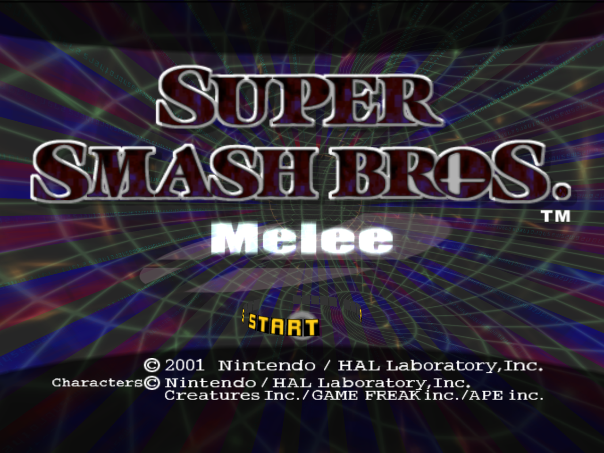
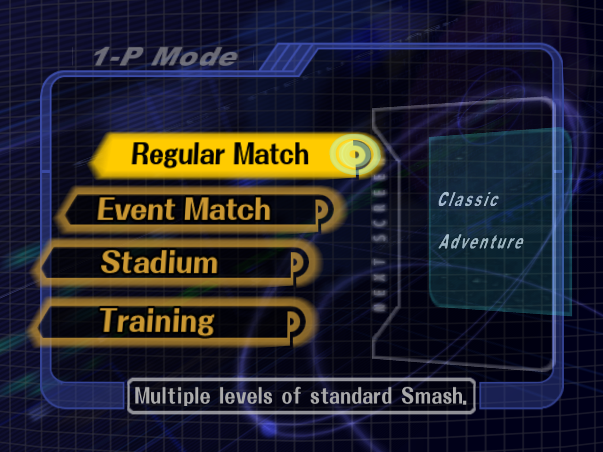
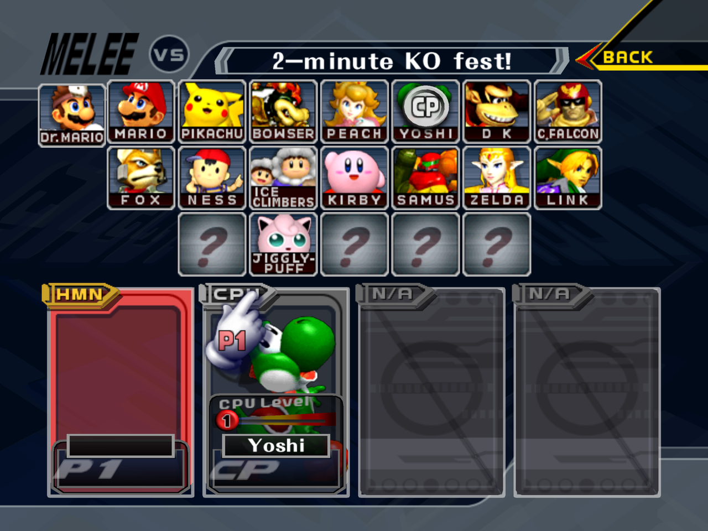
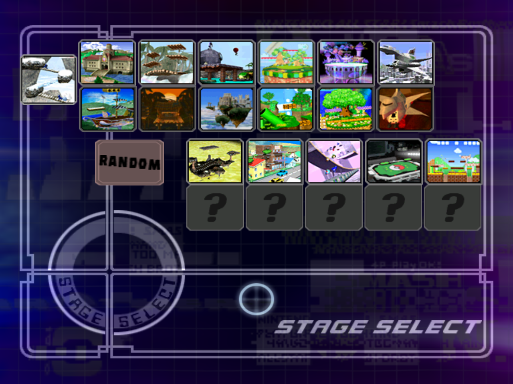
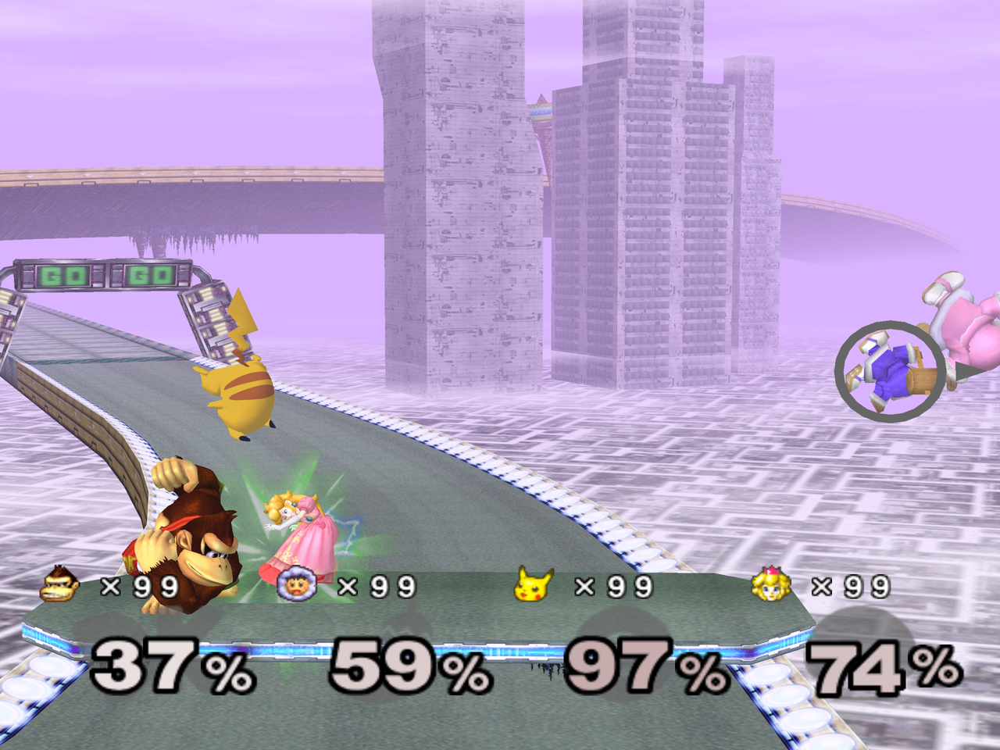
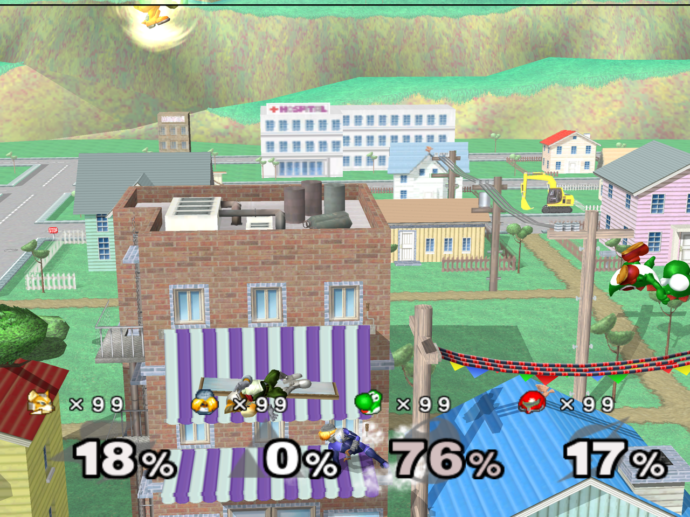
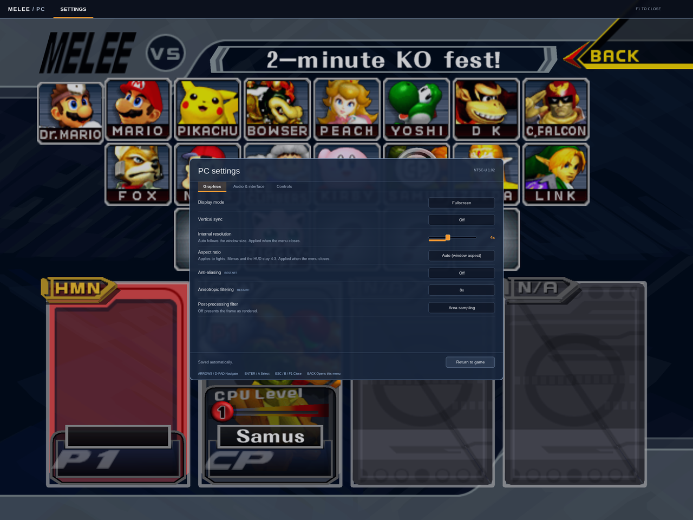
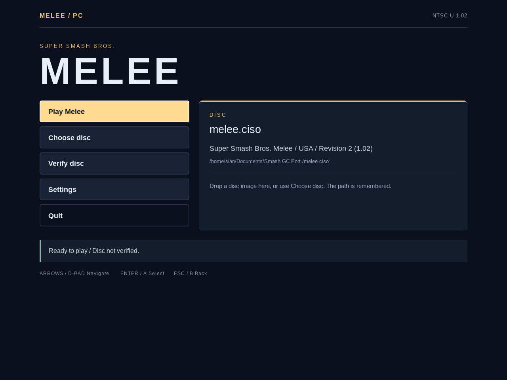
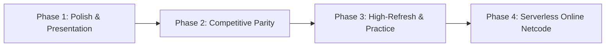

# melee-pc

**Beta, for testing only.** "melee-pc" is a working name. Online play with
rollback netcode is in development: on this branch two copies play over a
LAN or a direct IP (see [Netplay](#netplay-lan-and-direct-ip-prototype));
internet matchmaking is **not implemented yet**.

A native PC port of Super Smash Bros. Melee (NTSC-U 1.02), built from
[doldecomp/melee](https://github.com/doldecomp/melee) on top of
[aurora](https://github.com/encounter/aurora) (GX/OS/PAD/DVD/CARD/THP
compatibility layer with a WebGPU backend) and SDL3. Same approach as
[dusklight](https://github.com/TwilitRealm/dusklight).

You need your own disc image. No game data ships here.

## Features

- Native Linux, Windows, macOS (Apple Silicon) and Android (arm64) builds,
  rendered through Dawn/WebGPU (Vulkan, D3D12, Metal) and SDL3.
- RmlUi launcher with disc selection and SHA-1 verification against the Redump
  database before boot.
- In-game settings overlay on **F1**, with the game paused underneath.
- Internal resolution from Auto to 10x native (6400x4800).
- Post-processing shaders: area sampling, CRT scanlines, vibrant.
- 4x MSAA and anisotropic filtering up to 16x.
- Gamepad remapping, including C-stick directions, saved per device.
- Software AX audio mixer with multi-bus volume controls (Master, Music, SFX).
- Custom soundtrack streaming (`.ogg` and `.wav` in `~/.local/share/melee-pc/music/`).
- Dolphin-compatible `.gci` memory cards.
- Custom HD texture pack replacements (`~/.local/share/melee-pc/textures/`).
- "Unlock Everything" toggle (instant 26 characters, 11 secret stages, and All-Star mode).
- Hazardless stages (Frozen Pokémon Stadium in permanent neutral mode).
- Free / Unlocked pause camera (360° rotation and unlimited zoom) and Wide HUD anchoring.

## Screenshots



| | |
|---|---|
|  |  |
| Main menu | Character select |
|  |  |
| Stage select | Four-player match |
|  |  |
| Onett | F1 settings overlay |



## Development Roadmap

See the complete architectural design document at [ROADMAP.md](ROADMAP.md).



### Phase 1: Presentation Polish & System Integrations (Delivered)
- [x] **Dolphin-Format Texture Replacements**: Full folder scanning (`.dds` / `.png`) with runtime reload.
- [x] **Unlock All Toggle**: Bypass character/stage unlock grind; instant All-Star mode access.
- [x] **Multi-Bus Audio Control**: Independent volume sliders for Music (BGM) vs. Sound Effects (SFX).
- [x] **Wide HUD Anchoring**: Anchor damage percentages, stock icons, and timer to the 16:9 viewport boundaries.
- [x] **Custom Soundtrack Streaming**: User-provided `.ogg` / `.wav` files in `music/` override stage BGM.
- [x] **Free / Unlocked Pause Camera**: 360-degree rotation and unconstrained zoom for pause camera screenshots.
- [ ] **Discord Rich Presence**: Real-time rich presence displaying mode, stage, fighter, and score (deferred until API credentials available).

### Phase 2: Tournament & Competitive Parity (Upcoming)
- [ ] **Direct 1000 Hz GameCube Controller Adapter Support**: Overclocked 1 ms polling via `libusb` / `WinUSB` for official Wii U and Mayflash adapters.
- [ ] **UCF (Universal Controller Fix)**: Native 1.0 Dashback and Shield Drop angle standardization.
- [ ] **Extended Hazardless Stages**: Whispy wind toggle, Randall cloud toggle, static FoD platforms.
- [ ] **Controller Rumble & RGB Port Indicators**: Native haptics and player color LED matching.
- [ ] **2-Player Keyboard Remapping**: Split-keyboard competitive support.

### Phase 3: High-Refresh-Rate & Practice Suite
- [ ] **High-Refresh-Rate Frame Interpolation (120 Hz / 144 Hz / 240 Hz)**: Smooth motion presentation with locked 60 Hz simulation and physics.
- [ ] **Training & Practice Tools**: Hitbox/hurtbox visualizer, L-cancel flash indicators, frame advance / slow motion, training savestates.
- [ ] **Replay Recording & Playback**: Export inputs and seeds to Slippi `.slp` files with native replay player.

### Phase 4: Serverless Online Netcode (BitTorrent-Style P2P Matchmaking & Rollback)
Design: [docs/netcode-plan.md](docs/netcode-plan.md).
- [ ] **Native Rollback Netcode**: Slippi-model rollback (delay 0–4, 7-frame window) on native memory snapshots.
- [ ] **BitTorrent-Style Decentralized Matchmaking (Serverless P2P)**:
  * **DHT / Kademlia Peer Discovery**: Mainline DHT peer discovery eliminating central matchmaking servers and hosting costs.
  * **Decentralized Connect Codes**: `NAME#XXXX` codes derived from a per-install keypair.
  * **NAT Traversal & UDP Hole-Punching**: Direct P2P connectivity behind home routers.
- [ ] **Unranked, Ranked, Direct and LAN modes**: Slippi ranked ruleset; on-device Weng-Lin rating from doubly-signed match records published to the DHT; LAN via mDNS.
- [ ] **Native menu integration**: `Online` under VS Mode, lobby, quick chat, HUD ping/delay.
- [ ] **macOS Support** (Apple Silicon / Metal).
- [ ] **RetroAchievements Integration**: Native achievement tracking.

## Status

Works end to end:

- Boot, opening movie, memory card create/load, title, attract demos.
- Main menu, VS Mode, character and stage select; human vs CPU matches play.
- 1-P Classic, Adventure, and All-Star run to completion, with results and score saved.
- Training, Stadium (Target Test, Home-Run Contest, 10-Man Melee).
- Trophy gallery, Event Match list, Icicle Mountain scrolling.
- Music, sound effects, custom soundtrack overrides, saves.
- Cheats menu: "Unlock Everything", Frozen Pokémon Stadium, Free pause camera.
- Wide 16:9 combat camera and Wide HUD anchoring.

In development: online play with rollback netcode & BitTorrent DHT peer matchmaking, 1000 Hz GameCube controller polling, UCF, practice mode hitboxes/savestates. macOS (Apple Silicon tested, Intel CI-built) is below.

## Building

Needs GCC (the game code relies on `scalar_storage_order("big-endian")`, which
only GCC implements), CMake 3.25+, Ninja, and a Vulkan driver. Aurora fetches
its own Dawn/SDL3/nod prebuilts.

```sh
cmake -B build -G Ninja
ninja -C build
```

No disc data is needed to build. The two HSD font atlases are pixel data from
the retail DOL, so instead of being committed they are read out of the disc
you supply, at boot (`src/pc/discfont.c`).

The release artifacts are produced by the same scripts CI runs, so they work
locally too. Windows cross-compiles from Linux with MinGW-w64; Android needs an
NDK (`ANDROID_NDK_HOME`) and a JDK 17.

```sh
tools/package_linux.sh      # dist/Melee-x86_64.AppImage + tarball
tools/package_windows.sh    # dist/Melee-Windows-x86_64.zip
tools/package_macos.sh      # dist/Melee-macOS-<arch>.zip (Melee.app)
tools/build_android.sh      # dist/Melee-Android-arm64.apk (signed release)
```

### macOS

Apple Silicon (tested) and Intel (CI-built, untested). Apple's clang builds the C++; the decomp's C still needs
GCC, so `tools/gcc_launcher.py` routes `melee_game` through Homebrew's `gcc`
(the same split the Android build uses). Dawn comes as a prebuilt with a Metal
backend.

```sh
brew install gcc cmake ninja sdl3 zstd libpng freetype
cmake --preset macos-default
ninja -C build/macos
build/macos/melee <disc>
```

arm64 macOS kills native binaries whose `__PAGEZERO` is under 4GB and requires
PIE, so the non-PIE/`MAP_32BIT` layout the other platforms use is impossible.
Instead MEM1 is mapped at an address whose low 32 bits are `0x80000000`, so a
MEM1 pointer truncated to 32 bits *is* its GameCube address, and `DP()` restores
the high half (`PC_MEM1_ALIAS` in `src/pc/disc.h`).

`Melee.app` is ad-hoc signed, so the first launch of a downloaded copy needs
right-click > Open, or `xattr -d com.apple.quarantine Melee.app`.

## Running

```sh
build/melee                              # open the launcher
build/melee <disc.iso|.gcm|.ciso|.rvz>
```

**Melee USA revision 2 (NTSC-U 1.02, GALE01)** is the supported disc. A
**Europe (PAL, GALP01)** image also boots, experimentally: the game code is
still the USA build, the DVD layer serves the English (UK) `.ukd` text files
where the code asks for `.usd`, and the USA-only trophy tables missing from
`TyDatai` get empty stand-ins (`src/pc/region.c`). Gameplay is therefore
NTSC (60 Hz) on PAL data. A valid disc path on the command line boots straight
in; a missing or invalid one returns to the launcher. Settings and the selected path live in `launcher.cfg` in SDL's
`melee-pc` preference directory (usually `~/.local/share/melee-pc`, or
`~/Library/Application Support/melee-pc` on macOS).

Verification reads the disc through nod, compressed images included, and compares
SHA-1 against the
[Redump DAT](https://github.com/libretro/libretro-database/blob/master/metadat/redump/Nintendo%20-%20GameCube.dat):
`d4e70c064cc714ba8400a849cf299dbd1aa326fc`, 1,459,978,240 bytes. It supports
progress and cancellation, and is not cached between launches. Unverified images
still play; PAL images have no reference hash and always report as unverified.

Keep `resources/` next to the binary when distributing. The bundled Liberation
Sans fonts are covered by `resources/FONT-LICENSE.txt`.

## Controls

Keyboard: arrows = stick, IJKL = C-stick, X = A, Z = B, C = X, V = Y, Q/E = L/R,
Tab = Z, Enter = Start, TFGH = D-pad. Gamepads work through SDL.

| | Keyboard | Gamepad |
|---|---|---|
| Navigate | Up/Down, Tab | D-pad or left stick |
| Adjust | Left/Right | D-pad left/right |
| Change tab | Left/Right on the tab strip | L/R shoulders |
| Select | Enter | A |
| Close overlay | Escape, F1 | B, Start, Back |

## Settings overlay

**F1**, or Back/Select on a gamepad, opens the overlay. The game pauses while it
is open.

- Display: fullscreen/windowed and VSync apply immediately. `MELEE_VSYNC`
  overrides the saved preference.
- Internal resolution and UI scale are sliders. UI scale covers 75% to 150%.
- Post-processing picks the presentation shader and applies immediately.
- Anti-aliasing and anisotropic filtering apply on the next launch. MSAA offers
  only off and 4x because WebGPU guarantees sample counts 1 and 4.
- Audio: master volume, mute, FPS counter, all immediate.
- Controls remaps a gamepad. Pick the port, select a GameCube button, then press
  the physical button. Escape cancels, Restore resets the port. Back cannot be
  bound since it opens the menu. Sticks and triggers remap the same way, and a
  direction accepts either a stick axis or a button.

Melee's own menu sounds play in the overlay. Bindings are stored in aurora's
per-device `.controller` files; everything else shares `launcher.cfg`.

## Environment variables

| Variable | Effect |
|---|---|
| `MELEE_SEED=<n>` | Deterministic RNG for the attract demo. |
| `MELEE_HEAP_CHECK=1` | Canaries on every heap allocation, checked each frame; aborts at the first stomp. |
| `MELEE_FPS=1` | Print frame rate once a second. |
| `MELEE_AUDIO_DUMP=<file>` | Also write the mix as raw f32 stereo 32 kHz. |
| `MELEE_WINDOW_TITLE=<t>` | Window title. |
| `--no-card` | Boot without a memory card. |
| `--dvd <image>` | Explicit form of the positional disc argument. |

Diagnostics are off by default and cost nothing when unset. They measure or
suppress only; none of them fixes anything.

| Variable | Effect |
|---|---|
| `AURORA_LOG_UNTEX=1` | Report draws that bind no texture. |
| `AURORA_SKIP_UNTEX=1` | Drop every untextured draw. |
| `AURORA_SKIP_UNTEX_VTX=n` | Drop untextured draws with exactly n vertices. |
| `AURORA_LOG_TEV=1` | Report what an untextured draw's TEV stages asked for. |
| `MELEE_MOBJ_MARK=1` | Tag draws with whether the material had a texture. |
| `MELEE_TEV_TREE=1` | Count compiled TEV stages and how many carry a texture. |
| `MELEE_TEX_ASSIGN=1` | Count tobjs assigned a texmap vs forced to null. |
| `MELEE_PS_TEXMISS=1` | Report particles that ask for a texture but resolve none. |
| `MELEE_SFX_STATS=1` | Sound-effect request/accept/reject counts. |
| `MELEE_AUDIO_STATS=1` | Per-0.5s voice census. |
| `MELEE_AUDIO_ADDR=1` | Report voice sample addresses against the ARAM bounds. |
| `MELEE_CPU_TRACE=1` | Per-CPU-player AI census every ~2s. |
| `MELEE_EF_LOG=1`, `MELEE_EF_SKIP=a-b` | Report or suppress effect ids. |

## Netplay (LAN and direct IP, prototype)

Two copies of the game play a rollback match over UDP (`src/pc/net.c`;
design and current state in [docs/netcode-plan.md](docs/netcode-plan.md)).
Both must run the same build **and the same game image**, with no memory card
(`--no-card`). The LAN lobby announces a 32-bit id of the disc it booted
(region, revision, file-table shape and the DOL, so a code mod counts), and a
peer on a different image is listed as incompatible before a single game
packet is exchanged — same as a different build version. Direct connect does
not check either: there is no lobby record to read them from.

In the menus: VS Mode → ONLINE → LAN PLAY finds other
copies on the local network by mDNS and the first Start elects a host
(lowest install id wins a tie); DIRECT CONNECT takes the other machine's
`ip:port` and needs no discovery, which is also the way past Wi-Fi client
isolation. The game port is UDP 41000 by default and discovery uses UDP
5353 multicast; allow both through the firewall (Windows asks on first
launch). The install id used for the election is `install_id` in
`launcher.cfg`.

If the link drops mid-match, the session no longer dies with it: after 7 s of
silence it enters a reconnect phase and resumes where it left off if the peer
comes back within 15 s and neither side's 64-frame input ring has been
outrun. The lobby shows "reconnecting"; a failure that cannot be resumed says
"Could not resume" instead of "Connection timed out".

**What works where.** Only Linux x86-64 has played real matches, but a Linux
recording now replays bit-identical on Windows, so the two builds compute the
same game.

| Platform | Netplay | Rollback | Notes |
|---|---|---|---|
| Linux x86-64 | yes | yes | the configuration everything below was measured on; longest run 36 minutes and 126k frames of match |
| Windows | yes, but lockstep | **no** | the snapshot region is named by an ELF linker script, which PE/COFF cannot use, so the session never predicts and input delay has to cover the whole round trip. Determinism against Linux is proven by replay; two machines actually playing has not been tried |
| macOS / iOS | builds, never run | no | same linker limitation; no macOS hardware here to try it on |
| Android | builds, never run on a device | yes, in principle | LAN discovery needs the Wi-Fi multicast lock, which the app now holds only while the lobby is open |

| Variable | Effect |
|---|---|
| `MELEE_NET=<host:port>` | Connect to that peer at boot, no lobby (`MELEE_NET_PLAYER` and the same `MELEE_SEED` on both sides). |
| `MELEE_NET_PORT=<n>` | Local UDP game port (default 41000). Two copies on one machine need different ports. |
| `MELEE_NET_PLAYER=0\|1` | Controller port the local player drives with `MELEE_NET`: 0 = P1/host, 1 = P2. |
| `MELEE_NET_DELAY=<n>\|auto` | Input delay in frames (default `auto`: 1–4 from ping and jitter, re-evaluated every 600 frames, changed only between matches). |
| `MELEE_NET_RECONNECT_MS=<ms>` | How long a broken link may take to resume (default 15000). `0` disables the reconnect phase: the session drops 7 s after the peer goes quiet, as it used to. Anything negative or unparseable falls back to the default. |
| `MELEE_LAN_TEST=1\|host` | LAN lobby without the menu; `host` presses Start once the title is up. Both set to `host` exercises a simultaneous Start. |
| `MELEE_LAN_DIRECT=<ip:port>` | Direct connect without the menu, at frame 300; set on both sides with the other's address. The lower `ip:port` hosts. |
| `MELEE_NET_HANDSHAKE_TEST=1` | Run the RULES/READY handshake at frame 300 with `MELEE_NET`, no lobby. |
| `MELEE_NET_RECORD=<file>` | Write the seed, then per frame the four pad states simulated and a state checksum. |
| `MELEE_NET_REPLAY=<file>` | Feed a recording back in; reports the first frame whose checksum differs (`net: REPLAY DIVERGED`). Solo only. |
| `MELEE_NET_STATE_LOG=<file>` | Write two lines per frame to that file: the readable state line, and the raw float bits of exactly the fields the checksum covers. Only meaningful with `MELEE_NET_RECORD`/`MELEE_NET_REPLAY`; this is how two platforms' runs are diffed down to the field that differs. |
| `MELEE_INPUT_TRACE=1` | One `pad: ` line per change of port 0's virtual pad, with the focus and fifo state that produced it. |
| `MELEE_NET_SYNCTEST=1` | Run every tick twice from a restored snapshot and compare state hashes; sound is off. Proves the snapshot covers everything a tick reads. |
| `MELEE_NET_ROLLBACK=off` | Play the session in lockstep — no prediction, no snapshots. A bisecting tool, not a mode. |
| `MELEE_NET_SYNC=off\|legacy` | Measure the clock offset but never act on it, or restore the pre-batch skip behaviour. |
| `MELEE_NET_PAD_QTYPE=0` | Restore the raw pad queue's shifting overflow branch; the regression test for the input-slip fix. |
| `MELEE_NET_AUDIO_JOURNAL=off`, `MELEE_NET_AUDIO_DEAF=off` | Restore the two audio behaviours netplay overrides for determinism; each is the regression test for its own defect. |
| `MELEE_NET_RESIM_AUDIT=<k>` | Every 120 frames, roll back k frames and re-run them from unchanged inputs, comparing every snapshot region and checksum. The instrument that proves re-simulation is faithful. |
| `MELEE_NET_EXIT_AFTER_FRAMES=<n>` | Disconnect (BYE) and exit at that frame, logging `net: test done at frame n`. |
| `MELEE_NET_SIM_OOM_FRAME=<n>` | Fail the first snapshot taken at or after that frame, the way a failed allocation would, to exercise the lockstep fallback. |
| `MELEE_NET_SIM_LOSS=<pct>` | Drop that share of outgoing packets. |
| `MELEE_NET_SIM_DELAY_MS=<ms>` | Hold every outgoing packet that long. |
| `MELEE_NET_SIM_DELAY_RX_MS=<ms>` | Hold every incoming packet that long (asymmetric links). |
| `MELEE_NET_SIM_JITTER_MS=<ms>` | Uniform ±ms on the outgoing delay; reorders when larger than the delay. |
| `MELEE_NET_SIM_REORDER=<pct>` | Hold that share of packets behind the next one. |
| `MELEE_NET_SIM_DUP=<pct>` | Send that share of packets twice. |
| `MELEE_NET_SIM_BURST=<n>` | Every 5 s drop n consecutive outgoing packets. |

The link simulator's PRNG is seeded from `MELEE_NET_PORT`, so a run repeats.
Every 600 frames the log prints rollbacks, stalls, ping, jitter, loss and
snapshot cost; `net: DESYNC`, `net: cannot roll back` and `net: peer silent`
are the lines that mean something went wrong. Two copies on one machine also
need distinct `MELEE_CACHE_DIR` (pipeline cache) and `MELEE_KEY_FIFO` if you
drive them with key injection. Keyboard keys only reach the game while the
window has keyboard focus; `MELEE_KEY_FIFO` keys are deliberately exempt, so
harnesses can still drive menus in background windows.

A run that never leaves a menu proves nothing: outside a fight the state
checksum covers only the four pads and the RNG seed, so two title screens can
neither desync nor roll back. The harnesses below check that a match really
started before they report anything.

| Tool | What it does |
|---|---|
| `tools/net_test.py` | Two instances on this machine through a real match, asserting on both logs (both reach `net: test done`, exit 0, no DESYNC, no `peer silent`, no lost rollback). Direct mode boots straight into Link vs Mario via `MELEE_NET` + `MELEE_DEBUG_VS=1`; `--lan` walks the real menus into the LAN lobby and needs the shared LAN free; `--scenes` walks CSS and SSS too; `--oom FRAME` and `--disconnect` cover the snapshot-failure and hard-drop paths. |
| `tools/net_acceptance.py` | The same across a link matrix (loss, delay, jitter, reorder, dup, burst, asymmetric rx) into one markdown table. |
| `tools/net_lan_test.py` | Lobby paths a match never reaches: simultaneous Start, direct connect, a peer killed mid-lobby, the host killed while the guest connects. |
| `tools/net_determinism.py` | Records one run and replays it on every platform reachable from this machine, reporting the first frame that differs. Android and macOS report SKIPPED rather than passing. |
| `tools/net_fuzz.py`, `tools/net_lan_fuzz.py` | Malformed game datagrams and malformed mDNS records against a running instance. Both keep their crafted multicast on this host (`IP_MULTICAST_TTL 0`). |

```sh
python3 tools/net_test.py                                  # 2 min, clean link
python3 tools/net_test.py --loss 5 --delay 30 --jitter --reorder
python3 tools/net_test.py --lan --minutes 1
python3 tools/net_test.py --fuzz                           # tools/net_fuzz.py hammers A's port
python3 tools/net_determinism.py --only linux,linux-flip   # ~2 min, no Proton
```

`--exe build/melee`, `--disc ../melee.ciso`, `--port 42050` (B uses +1) and
`--work /tmp/net_test` (logs in `a.log`/`b.log`) are the defaults.

## Porting notes

Disc data stays big-endian in memory and is described with `DISC_STRUCT` and
`DISC_PTR` (see `src/pc/disc.h`). Structs mapping archive contents are byte-swapped
on access by GCC, disc pointers are 32-bit slots relocated to host addresses, and
MEM1 is mapped at `0x80000000` so those slots always fit. The whole 4 GB range is
game-addressable through `-no-pie` with text at `0x10000000`.

Bug classes that keep coming back when bringing up a new scene:

- Runtime structs have 8-byte pointers, so any hard-coded GameCube offset
  (`(u8*)gp + 0xD8`, `memzero(p, 0x74)`, padded overlay structs) has to become a
  real field or `sizeof`.
- Statics are not adjacent on x86-64. A cast to a bigger struct to reach the next
  static must name the neighbour instead.
- Bitfields are LSB-first. Unions overlaying bitfields with an integer view need
  `DISC_STRUCT` on the union and every nested struct.
- `UNK_T` is `void*`, so unnamed words are 8 bytes. Inside a union view that is a
  layout change; retype numeric ones `u32`.
- Motion-variable unions (`Fighter::mv`) have the same problem one level down: the
  game writes one view and reads another, so a pointer inside a view shifts every
  member below it. Where no position survives, move the field into `Fighter`.
- Retail `GXEnd` is empty and the decomp omits it, but aurora's `GXEnd` submits
  the draw. Every `GXBegin` needs one.
- `Mtx` is 48 bytes and `Mtx44` is 64; `MTXOrtho` and `MTXPerspective` take `Mtx44`.
- `bool` in a decomp signature usually means "int the decompiler could not name".
  Under `_Bool` every value above 1 clamps, so an index or scene id silently
  becomes 1.
- Walking an object as `void**` and indexing by GameCube word number scales by 8,
  so `p[0x14]` for byte 0x50 lands at byte 160. Index by name.
- Japanese string literals are Shift-JIS at runtime; the build passes
  `-fexec-charset=CP932`.

Three harnesses find the next batch. Validate any sweep by re-introducing one
known-true positive and checking the count moves by exactly one.

- Whole-tree warning sweep: compile every TU for real (`-Wreturn-type` is not
  emitted under `-fsyntax-only`), strip the build's `-Wno-all -Wno-extra`, pass
  `-fdiagnostics-color=never`, and add `-Warray-bounds=2 -Wstringop-overflow=2
  -Wformat-overflow=2 -Wbool-operation`.
- `python3 tools/lint_sweep.py` compiles every game TU with `-m32 -DLINT`, which
  turns `ASSERT_SIZE` and `ASSERT_OFFSET` into real checks against the GameCube
  ABI. A failure means the struct reconstruction is wrong, not the port.
- `python3 tools/compile_check.py <files|dirs>` syntax-checks with the build's
  exact flags. Fast, so use it before a full build.

For "does this union view still alias on LP64", build one probe TU of the real
headers twice with the project's flags, native and `-m32`, then diff member
offsets and sizes out of DWARF (`gdb -batch -ex 'ptype /o T'`). Compare byte-range
intersections, not start offsets.

## Tools

- `tools/run.sh <disc>` runs under gdb and dumps all threads on a crash.
- `tools/demo_run.sh <seed> [secs]` enters the attract demo and reports survival
  or crash frames; `tools/demo_sweep.sh <seeds...>` batches it.
- `tools/devctl.py key|hold|shot` drives and captures the game window under X11.
- `tools/run_dbg.sh <disc>` adds a FIFO/PAD state dump on interrupt.

`import -window` can keep returning the last composited frame under Xwayland while
the game presents normally, which looks like a freeze and is not one. `devctl.py
shot` detects two identical captures and nudges the window; when a screenshot and
a backtrace disagree, believe the backtrace.

## Contributing & Coding Style

Please refer to [CODING_STYLE.md](CODING_STYLE.md) for architectural guidelines,
formatting standards, 64-bit portability rules, and verification procedures. Run
`python3 tools/check_style.py` before opening pull requests.

## Layout

- `src/melee`, `src/sysdolphin` - game code from the decomp (upstream commit in
  `src/UPSTREAM_COMMIT`), adapted to the PC data model.
- `src/pc` - platform layer: main, OS/VI/GX glue, keyboard, audio mixer, THP,
  vertex-array sizing.
- `extern/aurora` - vendored aurora with local changes.

## License

Three situations, spelled out in [LICENSE.md](LICENSE.md): the decompiled
game code in `src/melee` and `src/sysdolphin` is **not licensed** and remains
the property of its copyright holders; the port code in `src/pc`, `tools`,
`platforms`, `cmake` and `.github` is **GPL-3.0-or-later** ([COPYING](COPYING));
bundled third-party components keep their own licenses. Because the game code
cannot be relicensed, the repository as a whole is not distributable under the
GPL. No game assets are in this repository.
