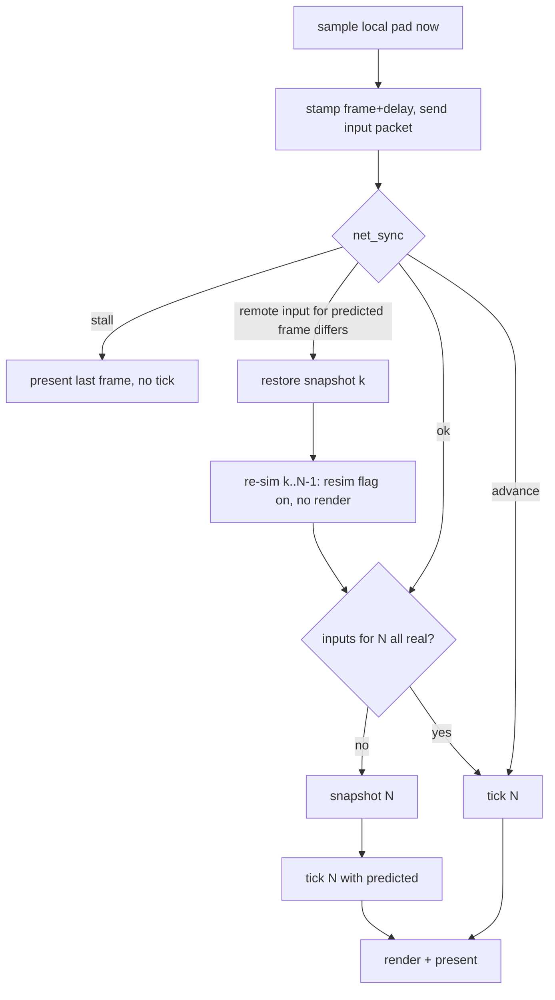

# Netcode plan: rollback, serverless matchmaking, ranked, LAN

Expands ROADMAP.md Phase 4. Everything below is grounded in the current tree
(`file:line`) or a cited external source. Model: Slippi's rollback and set
flow, re-implemented natively; matchmaking and ranked replace Slippi's central
server with the BitTorrent Mainline DHT and signed, on-device rating records.

## 1. Decisions

| Topic | Decision | Why |
|---|---|---|
| Rollback | Slippi numbers: input delay default 2 (user 0–4), rollback window 7, prediction = repeat last input, snapshot only on predicted frames | Proven on this exact game; native snapshot is cheaper than Dolphin's so delay can go lower |
| Snapshot | Whole-region `memcpy` of game statics + live OSAlloc heaps, audio heap excluded | Same shape as `SlippiSavestate.cpp`; ~2.2 MB statics (measured) + heaps; optimise only if measured > 2 ms |
| Transport | Raw UDP, Slippi packet layout, inputs resent every frame until acked, ~150-line stop-and-wait for lobby messages | No transport lib exists today (`CMakeLists.txt:32-55`); ENet only if the reliable channel turns out to be more than that |
| Matchmaking | Mainline DHT (jech/dht, MIT, ~3.1k lines C) — `announce_peer(implied_port=1)` + `get_peers` on time-bucketed topic infohashes; BEP 42 `ip` field for external endpoint; simultaneous UDP open from the same socket | Serverless; the DHT *is* the rendezvous and reports the NAT mapping, so no STUN in v1 |
| NAT failure | Re-queue for another opponent (Slippi behaviour) | No relay = no infrastructure. libjuice (MPL-2.0) only if measured failure rate justifies it |
| Modes | Ranked, Unranked, Direct (connect code), LAN (mDNS) — all one engine, LAN just runs delay 0 | One code path |
| Identity | ed25519 keypair per install (Monocypher, BSD-2/CC0); code = `NAME#XXXX` (XXXX = base32 of pubkey hash) | No accounts; code stable, name free |
| Rating | Weng-Lin / OpenSkill 1v1 update computed identically on both peers from a doubly-signed match record; published as BEP 44 mutable item; hash-chained history | Same family Slippi appears to use; deterministic pure function; verifiable, honestly not cheat-proof |
| Menu | New `SEL_VS_ONLINE` in the VS Mode submenu → `GM_ONLINE` mode with a lobby scene, then vanilla CSS/SSS/VS/Results driven by synced inputs | Native look; reuses `gm_Mode_Vs_States` shape |
| Double Dash decomp | Nothing reusable as code: `NetGameMgr.cpp`/`LANEntry.cpp`/SDK IP stack are empty NonMatching stubs; only `NetGateApp.cpp` and `LANSelectMode.cpp` match. Borrow the UX: counter screen, host-owns-rules, sleep/awake barriers, halt-together | See §8 |

## 2. What the tree gives us today (hook points)

| Concept | Where | Notes |
|---|---|---|
| Frame loop | `gm_801A4D34` `src/melee/gm/gmscene.c:281-395` | Runs one sim tick per queued pad sample (`:312-374`), renders once (`:379-388`). Already "N ticks, one present" |
| Sim tick body | `gmscene.c:312-374` | `lb_800198E0`→`HSD_PadRenewMasterStatus`, `lb_80019900`, `gm_EvaluateAllControllerInputs`, `on_frame`, `lbAudioAx_80027DF8`, `HSD_GObj_RunProcs` |
| Local pad sample | `HSD_PadRenewRawStatus` `src/sysdolphin/baselib/controller.c:55-65` (`PADRead(now)`) | Fired by 1/60 s OSAlarm `fn_800195FC` `src/melee/lb/lb_0195.c:52`, delivered on the game thread from `pc_frame_boundary` `src/pc/vi.c:161` |
| Input injection | `HSD_PadRenewMasterStatus` `controller.c:351` reads `p->queue[p->qread]` | Replace the 4×`PADStatus` (16 B each on PC, `extern/aurora/include/dolphin/pad.h:112-126`) here. Every gameplay and menu consumer derives from `HSD_PadMasterStatus` (`fighter.c:1834-1890`, `gm_1A36.c:113-117`, `mncharsel.c:2414-2419`). Keyboard/touch already merge into port 0 via `PADSetVirtualStatus` (`src/pc/keyboard.c:150`) |
| Present / pacing / events | `pc_frame_boundary` `src/pc/vi.c:37-173` via `VIWaitForRetrace` `vi.c:176` | 60 Hz pacing at `vi.c:130-150` is where time-sync nudging goes |
| Frame counter | `gm_80479D58.unk_0` `gmscene.c:359` (static) | Expose as the rollback frame index |
| Sound start choke point | `AXDriver_8038CFF4` `src/sysdolphin/baselib/axdriver.c:597`, sole caller `fn_80023750` `src/melee/lb/lbaudio_ax.c:229-246` | Sim thread only links an `HSD_SM` record; voices are acquired on the SDL audio thread (`synth.c:1215`). Return −1 while re-simulating |
| Music start | `lbAudioAx_80023F28` `lbaudio_ax.c:444` | Gate during re-sim |
| Rumble | `HSD_PadRumbleInterpret` `controller.c:64` | Gate during re-sim |
| RNG | single LCG `seed` `src/sysdolphin/baselib/random.c:3-16`, seeded from `OSGetTick` `src/melee/gm/gmmain.c:169` (`MELEE_SEED` override) | Exchange at connect |
| Match settings | `StartMeleeData` (`StartMeleeRules` 0x60 B + `PlayerInitData[6]`) `src/melee/mn/types.h:259`, in `VsModeData.start` | `onEnterDebugVs` `src/melee/gm/gmvsmode.c:161` is the template for "start GS_VS from a filled struct" |
| Mode/scene tables | `modes[]` `src/melee/gm/gmscdata.c:388`, `scenes[]` `:65`, `gm_Mode_Vs_States` `gmvsmode.c:28-129` | Add `GM_ONLINE` + `GS_ONLINE_LOBBY` |
| VS submenu | `mn_803EB6B0[MENU_KIND_VS]` `src/melee/mn/mnmain.c:378`, think `mn_8022D594` `:2473-2553`, `SEL_VS_NAME` last `src/melee/mn/forward.h:166` | Add `SEL_VS_ONLINE = 5`, `selection_count` 5→6, fix the wrap at `mnmain.c:2541-2552` |
| Menu labels | matanim texture frame `start_frame + selection*2` `mnmain.c:943,1481` (MnMaAll); free text via `HSD_SisLib_803A70A0` (`mncharsel.c:475`) | v1 labels as SIS text, textures later |
| Memory | MEM1 = one 96 MB mmap (`extern/aurora/lib/dolphin/os/OSMemory.cpp:226-290`); no `malloc` in game code; allocator statics outside MEM1 listed in §4 | Game statics: `libmelee_game.a` = 354 KB `.data` + 1.80 MB `.bss` (`size -t`) |
| Threads touching game memory | SDL audio (`src/pc/audio.c:559-575`, every 5 ms), DVD worker + ARQ (`dvd.cpp:560-611`, `AR.cpp:134-149`), FIFO draw-done cb | All bracket with `OSDisableInterrupts` = recursive mutex `src/pc/os.c:33-40` |
| Settings | `launcher.cfg` under `SDL_GetPrefPath` (`src/pc/main.c:328`), `Preferences` `src/pc/launcher_data.hpp:17-40`, `extern "C" pc_is_*` accessors (`launcher.cpp:1595`) | Pattern for `net_delay`, `display_name`, identity path |
| Networking | libcurl (Linux, optional) / WinHTTP for the updater only (`src/pc/updater.cpp:409-611`); nothing on Android/iOS | All net code is new |

## 3. Architecture

```
src/pc/net/            PC layer (C, platform compiler)
  net_udp.c            one non-blocking UDP socket, DSCP EF, WSAStartup
  net_proto.c          packet encode/decode, ack, reliable stop-and-wait
  net_sync.c           input queues, prediction, time-sync, stall/advance
  net_snapshot.c       region table, capture/restore ring (8 slots)
  net_dht.c            jech/dht + BEP 42 ip + BEP 44 put/get, bootstrap cache
  net_match.c          queues (ranked/unranked/direct), handshake, rules exchange
  net_lan.c            mDNS announce/browse (mjansson/mdns), lobby peer list
  net_rank.c           identity, Weng-Lin update, signed records, publish/verify
src/melee/gm/gmonlinemode.c   GM_ONLINE state machine (lobby → CSS → SSS → VS → Results)
src/melee/mn/mnonline.c       submenu (Ranked / Unranked / Direct / LAN / Profile), lobby panel, HUD text
src/sysdolphin/baselib/controller.c   input injection (one `if (pc_net_active())` in HSD_PadRenewMasterStatus)
src/melee/gm/gmscene.c                tick body factored into gm_RunSimTick(); online loop calls pc_net_* around it
```

Per-frame flow in online play (replaces `gmscene.c:312-374` when `pc_net_active()`):



Rules: the game thread owns everything; net I/O is polled from the loop (no
net thread). Snapshot/restore happens under `OSDisableInterrupts` so the audio
callback cannot interleave.

## 4. Rollback engine

**Inputs.** Wire unit = 8 B per port per frame (Slippi's `SlippiPad.h`:
buttons u16, 4 stick s8, 2 trigger u8); expanded to the 16 B PC `PADStatus`
at injection with `err = 0` for both peer ports and `PAD_ERR_NO_CONTROLLER`
for ports 3–4. Local port = P1 for the host (lower pubkey), P2 for the guest.
Stick at-rest clamp ±2 before sending (Slippi `TriggerSendInput.asm:100-125`)
so idle noise does not cause rollbacks.

**Snapshot regions** (implemented in `src/pc/net_snapshot.c:180-216`, `src/pc/melee_state.ld`):
1. `libmelee_game.a` `.data/.bss` bracketed by `__melee_{data,bss}_{start,end}`
   from the GNU ld `INSERT AFTER` script (`melee_state.ld:18-41`), **minus**
   the TUs in the "Excluded state" table below. Each of those was found by
   the sync test, not guessed.
2. The `HeapDesc[]` array at the arena start (`aurora_heap_descs`) — list
   heads live outside every cell and the first attempt missed them.
3. Every OSAlloc heap's live extent (`aurora_heap_extent`: allocated cells in
   full, free cells header-only) except the audio heap `HSD_Synth_804D6018`.
   The gameplay heap is `current_heap` (`initialize.c:229`); lbHeap sub-heaps
   hold preloaded read-only file data and are not covered.
4. `HSD_RandSeedPtr` (aurora-side pointer the game redirects).
5. Netcode's own state lives in `src/pc/net.c`, outside every region.

Measured on a live Link vs Mario match: 5.6 MB, 0.6 ms per snapshot (plain
memcpy). No dirty tracking needed.

**Rollback barrier** (`net.rb_barrier`, `net.c:90-117`). No frame ≤ the
barrier is ever rolled back to: `fresh_tick` predicts nothing up to it and
runs lockstep instead (`net.c:874-875`), and `rollback_to` refuses a
restore behind it (`net.c:799-803`). It only rises (`barrier_raise`,
`net.c:104-108`) and is reset per session (`net.c:535`).

| Raised by | Barrier | Why |
|---|---|---|
| Scene change (`scene_kind()` differs from the last fresh tick, `net.c:866-870`) | `frame + 120` (`IO_QUIET`, `net_internal.h:104`) | heaps are torn down and rebuilt around it and its loads trail into the next frames; a snapshot also records its scene and cannot be taken back in another (`snapshot_unusable`, `net_snapshot.c:261-264`) |
| Game-thread disc request (`pc_net_note_io` from `HSD_DevComRequest`, `devcom.c:417`) | `frame + 120` (`net.c:113-117`) | the tick that issued it cannot be re-run: a restore either double-issues the read (crash in `HSD_DevComDVDMemCallback`) or erases a completion the re-run then waits for forever; the completion lands on a worker thread some frames later |
| Lost rollback: no snapshot for the frame, behind the barrier, or scene changed (`rollback_to`, `net.c:799-815`) | newest simulated frame (`net.c:809`) | the misprediction stays in the timeline, so a desync is expected; one `net: cannot roll back` line per session |
| Snapshot buffer could not be grown (`snap_predicted`, `net.c:745-748`) | `INT32_MAX` | lockstep for the rest of the session (`net: out of memory for snapshots`) |

Aurora still exports `aurora_dvd_inflight()`/`aurora_arq_inflight()`
(`dvd.cpp:687`, `AR.cpp:174`) but the engine no longer consults them: the
audio thread streams music through the same DVD/ARQ path into ARAM all
match, so the counters never read zero during play and could not narrow the
window (`net.c:96-97`, `110-112`). Only game-thread requests count
(`net.c:114`), and they cost a fixed 120 frames of lockstep.

**Excluded state.** Everything a tick can touch that is deliberately not
part of the snapshot, and what stands in for it:

| State | Where excluded | Handling |
|---|---|---|
| Sound machine statics: `axdriver.c`, `synth.c`, `lbaudio_ax.c` | `melee_state.ld:3-4`, `:23` | the SDL audio thread owns them; restoring would tear its lists. Re-sim instead suppresses new sounds (`AXDriver_8038CFF4` returns −1, `axdriver.c:611`) and music starts (`lbaudio_ax.c:449`) via `pc_net_resim()` |
| Audio heap `HSD_Synth_804D6018` | skipped in `regions_now` (`net_snapshot.c:201`) | same owner as above |
| `perf.c`, `video.c`, `vtxarray.c`, `lbmthp.c`, `card.c` | `melee_state.ld:5-8` | wall-clock stats, XFB/VI state, host-side caches, THP pacing, async memcard context: engine state, not sim state |
| Pad alarm `lb_0195.c` | `melee_state.ld:9-12` | its fire time is wall-clock; rewinding it made the alarm catch up and queue extra ticks after every rollback. Its frame-skip accumulator is idempotent per tick at 60 Hz |
| Disc/ARAM request queues `devcom.c` | `melee_state.ld:13-16` | driven from the DVD/ARQ worker threads; rewinding them under a completion crashed `HSD_DevComDVDMemCallback`. Game-thread requests raise the barrier instead |
| Pad queue and `HSD_PadLibData` | *inside* the snapshot, but re-applied from the live copy after every restore with interrupts off (`rollback_to`, `net.c:817-829`) | raw samples queued since the snapshot survive; re-run ticks consume the slot `unconsume()` hands back (`net.c:770-778`), and the online path writes the queue head itself (`write_head` in `fresh_tick`, `net.c:847-897`), so a rollback never touches the raw sample stream. Queue type 2 while connected so a full queue drops the new raw sample, not the head (`net.c:650`) |
| Wall-clock OSAlarms (`src/pc/os.c`) | never copied | ticks are driven by the loop; a time-sync skip is paid at the frame boundary and the pad sample it queues is discarded (`pc_net_pace_adjust_ns`, `net_sync.c:140-150`) |
| ARAM and the music stream | never copied (`net.c:110-112`) | audio-thread traffic through the same DVD path; it does not raise the barrier and its ARAM writes are not sim state |
| File cache (`src/pc/file_cache.cpp`) | not memory state | a hit completes a load in 0 frames, a miss in N: a determinism gap, see the §5 checklist |
| Texture cache (aurora `texture.cpp:47-127`) | never copied | ids only; a stale `GXTexObj` just re-hashes and re-uploads |

**Side effects during re-sim** (`pc_net_resim` flag): `AXDriver_8038CFF4`
returns −1 (`axdriver.c:611`); `lbAudioAx_80023F28` no-op (`lbaudio_ax.c:449`);
the render block runs once per present after the re-tick loop (`gmscene.c:376-383`).
Rumble is not gated yet (`HSD_PadRumbleInterpret`, `controller.c:64`, has no
`pc_net_resim` check). v2: Slippi's per-frame SFX log
(16 sounds × 7 frames): dedupe on re-sim, key-off sounds the corrected
timeline never played (`LoopEngineForRollback.asm:70-118`). Sound→sim
feedback exists in exactly two places and is cosmetic: `Ground_801C54DC`
`src/melee/gr/ground.c:3120` (Corneria radio chatter, `grcorneria.c:2621`)
and the tournament screen; leave as known divergence.

**Time sync** (copy Slippi `SlippiNetplay.cpp:1660-1725`, `EXI_DeviceSlippi.cpp:1478-1641`):
offset sample per received packet = `sendTime − myLastSendTime + 16683·(myFrame − theirFrame)`,
30-sample ring, trimmed mean (drop top/bottom third). Every 30 frames: ahead
> 10 ms → stall ≤ 5 frames; behind > 26.7 ms → advance (2 ticks in one
present) ≤ 3 frames, 1 per 5 frames. Continuous nudging: ±0.5–1 % on the
`SDL_DelayPrecise` target in `vi.c:130-150` instead of emu speed. Hard stall
when remote lags > 7 frames; disconnect after 7 s stalled.

**Desync detection.** Each input packet carries `(checksumFrame, checksum)`
of the newest finalised frame: checksum over `*HSD_RandSeedPtr`, each
fighter's position/facing/percent/stocks/action state. Mismatch → HUD
warning + log; ranked → abort set with "desync" (Slippi's synced-state restart is v2).

**Invariants** the engine relies on:
- `s_remote_have` is the newest *contiguous* real remote frame
  (`net.c:49`): a packet's pads are applied only when `first <= have + 1`
  and a gap leaves it where it was, the ack names it so the peer resends
  from there (`on_inputs`, `net.c:269-290`). `confirmed_frame()` (`net.c:137-145`)
  caps on it, so `check_desync()` never compares a checksum over a predicted frame.
- A snapshot is valid only for the exact frame it was taken for: `snap_slot(f)`
  is refused unless `s->frame == f` (`net.c:800-801`) and every session
  frees all snapshots because the next session restarts at frame 0
  (`snaps_free`, `net_snapshot.c:441-456`).
- `s_rel_tx[s_rel_tx_head]` is the one reliable message in flight; nothing
  behind it goes out until its `K` arrives (`net_reliable.c:21-24`, `109-120`).
- All simulation, snapshot and restore happens on the game thread; the 4 ms
  SDL timer only touches the socket under `net.tx_lock` (`net.c:80-83`,
  `net_internal.h:19-48`), and `pc_net_note_io()` ignores other threads
  (`net.c:114`).
- Nothing at or below the barrier is rolled back to (`net.c:802`); the
  barrier never decreases within a session.
- The session id is chosen by the host (P1) and learned by the guest from
  the first packet (`net.c:662-663`, `414-416`); a guest with a stale id
  drops everything until it hears the host.
- Frames 0..delay−1 carry neutral input on both sides (`net.c:660`), so the
  first `delay` frames never need a remote packet.

## 5. Determinism prerequisites (M0)

Findings from the flag/libm audit (all four AArch64 targets plus MinGW and Linux):
1. Game code already has `-fno-strict-aliasing -fwrapv -ffp-contract=off` (`CMakeLists.txt:76-77`), but `aurora_mtx`/`aurora_gx` and `src/pc/*.c` do not → AArch64 emits `fmadd` in `PSVECNormalize` (`extern/aurora/lib/dolphin/mtx/vec.c:41`), `PSMTXMultVec`, `C_MTXRotRad`, used by collision (`mplib.c:1183,4919`). Fix: `-ffp-contract=off` on `aurora_mtx`, `aurora_gx`, `aurora_gd`, and the `melee` target.
2. `sinf/cosf/tanf/atanf` resolve to platform libm (glibc / mingw-w64 CRT / bionic / iOS) — used by `fighter.c:2217`, `ftcoll.c:910,2856`, `camera.c`, `ground.c:2882`, `mtx.c:334-379` — and `lbtrigf.c:147` only compiles the decomp's `atanf` under `__MWERKS__`. Fix: vendor one implementation (musl's `sinf/cosf/tanf/atanf`, MIT) into `src/pc/libm/`, `#define sinf pc_sinf` in `src/pc/compat.h` plus `-fno-builtin-sinf …`. `sqrtf/sqrt/fabsf/fmodf` are correctly rounded — leave.
3. Unify `-O2` (Linux is RelWithDebInfo, Windows/Android Release `-O3`: `tools/package_windows.sh:56`, `tools/build_android.sh:39`); keep `MELEE_ENABLE_LTO=OFF`; add `-ftrivial-auto-var-init=zero` to `melee_game`.
4. RNG: force an agreed seed at connect (`gmmain.c:169-174` already honours `MELEE_SEED`); `_HSD_RandForgetMemory` resets per scene (`random.c:23-28`) — must be in the snapshot.
5. Disc I/O: a file-cache hit completes the load synchronously, a miss takes N frames (`src/melee/lb/lbfile.c:145-150`); callbacks run on the DVD worker (`dvd.cpp:560-611`). Rule: prewarm every file the match needs (stage, both fighters, items, SFX banks) behind the "ready" barrier, so every in-match load is a 0-frame hit on both peers. Verify with a load-log injection (`MELEE_LOG_DVD`).
6. Alarms are wall-clock (`src/pc/os.c:174-215`); online ticks are driven by the loop, not the pad alarm.
7. Match-start state that must be identical on both peers (`gm_80167BC8` `src/melee/gm/gm_1601.c:3595-3727`): memcard `GameRules`/`GamePrefs`, handicap, unlock bitmasks (`gm_1601.c:2384`), random-stage switches, frozen-stadium (`grpstadium.c:2057-2067`), Sheik/Zelda A-hold at load (`gmvs.c:1597`). Host ships the 0x60-byte `StartMeleeRules` + `PlayerInitData[4]` + stage + seed + toggles; guest overwrites its copy; unlock-all forced on in online modes.

**Harness (must exist before M1):** `MELEE_NET_RECORD=file` records seed + per-frame 4×PADStatus + per-frame checksum; `MELEE_NET_REPLAY=file` replays and diffs. Validate by injecting a one-ULP change into `pc_sinf` and confirming the diff appears; then run one recording on x86-64 Linux, Windows (Proton and native), and Android; all must match.

**Checklist (state of the tree):**
- [x] `-ffp-contract=off -fno-fast-math` on `melee_game`, `aurora_mtx`, `aurora_gx`, `aurora_gd` and the `melee` target (`MELEE_FP_FLAGS`, `CMakeLists.txt:46-51`, `:110`, `:154`).
- [x] Trig from `src/pc/libm/` (musl): `pc_trig.h` renames `sinf/cosf/tanf/atanf` (`pc_trig.h:17-20`), pulled in by `compat.h:12` for game code and by `-include` for `aurora_mtx` (`CMakeLists.txt:49`), with `-fno-builtin-*` on both (`:48`, `:111`).
- [x] `-O2` on every platform: `CMAKE_C_FLAGS_RELEASE` is forced to `-O2 -DNDEBUG` (`CMakeLists.txt:20-24`), so the Windows/Android `Release` builds (`package_windows.sh:53`, `build_android.sh:41`) match Linux `RelWithDebInfo`; `-ftrivial-auto-var-init=zero` on `melee_game` (`:112`).
- [x] Agreed seed: `pc_net_connect(seed)` applies it on the host, RULES carries it to the guest, and both re-apply it entering `start_frame` (`net.c:664-667`, `net_handshake.c:134-137`, `net.c:895-897`); `HSD_RandSeedPtr` is snapshot region 3 (`net_snapshot.c:184`).
- [x] Record/replay harness (`MELEE_NET_RECORD`/`MELEE_NET_REPLAY`, `net_snapshot.c:25-85`) and the sync test (`MELEE_NET_SYNCTEST`, `net_snapshot.c:378-430`).
- [ ] Disc I/O frame counts: a file-cache hit vs miss still changes how many frames a load takes (`lbfile.c:145-150`). The barrier makes the first 120 frames after any game-thread request lockstep (§4), which hides it for rollback, but a load that lands on different frames on the two peers is still a divergence in lockstep. No per-match prewarm behind the ready barrier exists yet; `pc_file_cache_start_prewarm` (`file_cache.cpp:400`) is the boot-time background warm, and `MELEE_PREWARM=0` disables it.
- [ ] Cross-platform replay: one recording replayed on Linux x86-64, Windows (native) and Android has not been done; the 1-ULP `pc_sinf` injection check has not been run.
- [ ] `HSD_PadRumbleInterpret` in re-sim (`controller.c:64`, no gate).
- [ ] Sound→sim feedback (`Ground_801C54DC`, tournament screen): known divergence, cosmetic.

## 6. Transport and protocol

UDP only, one socket shared by DHT, game and lobby traffic (keeps the NAT
mapping warm; the DHT's own traffic is ~1 packet/min). Linux `SO_PRIORITY 7` +
`IP_TOS 0xb8`, Windows qWAVE DSCP 46 (Slippi `SlippiNetplay.cpp:953-1004`).

The table below is the target protocol for M4+. What is on the wire today
(v2) follows it.

| Message | Layout | Channel |
|---|---|---|
| `INPUT` | `u8 type, s32 frame, u8 player, s32 ckFrame, u32 ck, N × 8 B pads (newest first)` — N = all inputs newer than the last ack, cap 128 | unreliable, sent every tick and again 8 ms later (`ponytail:` double-send halves loss cost for 7 KB/s; drop if measured useless) |
| `ACK` | `u8 type, s32 frame, u8 player` | unreliable; ping = RTT of ack |
| `HELLO/HELLO_ACK` | version, pubkey, signature over (nonce, peer pubkey), mode, ruleset hash, rating head | reliable |
| `RULES` | `StartMeleeRules` + `PlayerInitData[4]` + stage + seed + toggles | reliable |
| `READY` | per-peer prewarm complete | reliable (barrier) |
| `SET_STEP` | Slippi `COMPLETE_STEP`: char/color/stage picks between games | reliable |
| `RESULT` | signed match record (see §9) | reliable |
| `CHAT` | quick-chat id (16 D-pad combos, Slippi ids) | reliable |
| `BYE` | reason | reliable, 3 sends |

### 6.1 Wire format v3 (as built, `src/pc/net_internal.h:106-183`, codec `src/pc/net_wire.c`)

Every multi-byte field is big-endian on the wire (`be16/be32/be64`,
`net_wire.c:46-110`); the packed structs are the exact wire image. Sizes are
pinned by `_Static_assert` (`net_internal.h:177-183`).

| Struct | Magic | Layout (bytes) | Size | Notes |
|---|---|---|---|---|
| `Hdr` | — | `u8 magic, u8 version, u32 session, u8 player` | 7 | prefixes every datagram (`net_internal.h:121-126`). `version` = `PC_NET_PROTO_VERSION` (`net.h:20`, currently 3). `session` is picked by the host, 0 on the guest until the host's first packet (`net.c:662-663`, `414-416`). `player` is the sender's port (0/1) |
| `WirePad` | — | `u16 button, s8 stickX, stickY, substickX, substickY, u8 triggerLeft, triggerRight` | 8 | Slippi's fields; sticks clamped to 0 within ±2 before sending (`at_rest`, `net_wire.c:10-24`) |
| `Packet` | `'M'` | `Hdr, u16 seq, s32 newest, s32 first, s32 ck_frame, u32 ck, u8 count, WirePad pads[count]` | 26 + 8·count, count ≤ 16 (`REDUNDANCY`) | `pads[i]` is frame `first+i`; everything since the last ack is repeated, the repeat width scaled by measured loss and rollback depth (`net_internal.h:128-138`, `send_inputs` `net.c:278`). `seq` is the per-session send counter: an exact duplicate is dropped and an out-of-order one still processed (`seq_check`, `net.c:354-378`), and the ack echoing it is the RTT sample. Sent every tick and again from the 4 ms timer; an empty one every 500 ms is the keepalive while the game thread is loading |
| `Ack` | `'A'` | `Hdr, u16 seq, s32 frame` | 13 | `frame` = newest contiguous remote frame the sender holds, ignored unless `≤ s_wrote` (a frame we actually sent: a higher one would leave `send_inputs` shipping nothing at all, `on_ack` `net.c:435-441`); `seq` echoes the acked packet, consumed once from a 64-slot ring so a late duplicate cannot skew the RTT (`net.c:443-455`) |
| `Rel` | `'R'` | `Hdr, u8 seq, u8 type, u16 len, u8 payload[len]` | 11 + len, len ≤ 256 | reliable channel (`net_reliable.c`); `type < 0x10` is the handshake (`0x01 RULES`, `0x02 READY`, `net_handshake.c:25-26`), `>= 0x10` goes to the caller (`pc_net_recv_reliable`). `0x10` is taken by `MELEE_NET_HANDSHAKE_TEST` (`net_handshake.c:223`), `0x11` is the LAN lobby's READY_BARRIER (empty payload, `net_lan.c:79`, `:709`), `0x12+` free |
| `RelAck` | `'K'` | `Hdr, u8 seq` | 8 | acks `seq`; a repeat of the last accepted seq is re-acked, anything else ignored (`on_rel`, `net_reliable.c:84-107`) |
| `Bye` | `'B'` | `Hdr, u8 reason` | 8 | `reason` is a `PC_NET_PEER_*` value; sent twice, unacked, from `pc_net_disconnect` (`net.c:563-566`) |
| `Rules` | (payload of `Rel` type 1) | `u32 seed, s32 start_frame, GameRules game, u8 item_freq, u64 item_mask, u32 stage_mask, u8 frozen_stadium, u32 hash` | 8 + sizeof(GameRules) + 18 (`net_internal.h:166-175`) | `hash` = FNV-1a over the wire image before it (`rules_hash`, `net_wire.c:106-110`). The guest rejects a set whose hash, `start_frame` (must be in `[0, now + 256]`) or values (`mode ≤ 3`, `time ≤ 99`, `stocks ≤ 99`, `damage_ratio 5..20`, `item_freq ≤ 5`, `stage_mask ≠ 0`) are off (`rules_invalid`, `net_handshake.c:103-116`) and the handshake fails (`:130-131`) |

Receive-side validation, in order (`recv_inputs`, `net.c:536-600`): source
address must be the peer's; `version` must match, else `PEER_INCOMPATIBLE`
and the peer is treated as gone (`:575-582`); `session` must match (guest
adopts the first non-zero one); `player` must be the remote's. Each reject
logs once per session (`net: dropped …`). Body lengths are checked per magic
in `rx_dispatch` (`net.c:470-531`), then `Packet` contents in int64 so the
comparisons cannot overflow at the INT32 ends: `first < 0`, pads past
`newest`, `newest` more than `RING/2` frames ahead, or `ck_frame` outside
`[-1, newest]` is dropped as malformed (`on_inputs`, `net.c:380-397`).

`tools/net_fuzz.py --launch --session auto` is the check for all of it: ~100k
crafted datagrams in 30 s with a valid header, bodies at every edge above,
while playing peer. Pass = alive, no DESYNC/silence, and — the part that
catches a wedge rather than a crash — the instance keeps sending pads. Its
first half withholds honest acks and never uses the INT32 ends, because an
`INT_MAX` ack overflows `s_last_acked + 1` into the negative clamp and hands
`send_inputs` a sane window again, masking the plain `newest + 1000` ack that
silently starves the peer.

**Bumping `PC_NET_PROTO_VERSION`** (`net.h:17-20`): required for any change
to a packed layout above, to `Rules` (including `GameRules` itself, since it
is copied raw), to the handshake types below `0x10`, or to the meaning of a
field. Both sides refuse the other with `PEER_INCOMPATIBLE` at the first
packet (`recv_inputs`, `net.c:406-413`), and the LAN lobby lists a peer announcing
another `v=` as incompatible before any packet is exchanged
(`net_lan.c:335`). A change that only adds a reliable type `>= 0x10` the
other side ignores does not need a bump. Bump the version, not the magic
letters.

### 6.2 Timeout policy

| State | Limit | Where | On expiry |
|---|---|---|---|
| Connected, no packet from the peer yet | 60 s (`CONNECT_TIMEOUT_MS`) | `net_internal.h:101`, `wait_remote` `net.c:471-475` | `PEER_TIMEOUT`, `net: peer silent for 60000 ms`, disconnect (`net.c:876-882`) |
| Stall (remote more than the window behind, or lockstep waiting) | 7 s (`STALL_TIMEOUT_MS`) | `net_internal.h:100`, `net.c:471-475` | `PEER_TIMEOUT`, `net: peer silent for 7000 ms`, disconnect |
| While stalled: resend our inputs | every 16 ms | `net.c:476-479` | — |
| Stall longer than 500 ms | marks `s_stall_frame` | `net.c:486-488` | `pc_net_quality()` reports 2 for the next 120 frames (`net.c:587-589`) |
| Keepalive while the game thread is not ticking | empty input packet every 500 ms | `net.c:182-187` | keeps the peer's silence timer and NAT mapping fresh |
| Reliable message unacked | resend every 250 ms (`REL_RESEND_NS`) | `net_reliable.c:13`, `rel_service` `:31` | resends until acked or disconnect; no separate give-up |
| Match handshake (RULES → READY) | 15 s (`HS_TIMEOUT_MS`) | `net_handshake.c:27` | `pc_net_handshake_state()` = 3, lobby fails with "handshake failed" (`net_lan.c:733-734`) |
| Handshake lead | 120 frames (`HS_LEAD_FRAMES`) | `net_handshake.c:28` | `start_frame` = host frame + 120 so READY has 2 s to arrive |
| LAN lobby: ready, no host elected | 15 s (`TIMEOUT_NS`) | `net_lan.c:77`, `:785-786` | `lan: failed: no host` |
| LAN lobby: connecting, handshake not done | 15 s | `net_lan.c:737-738` | `lan: failed: timeout` |
| LAN lobby: handshake done, peer's READY_BARRIER (0x11) not seen | 15 s | `net_lan.c:735-736` | `lan: failed: peer never became ready` |
| LAN election window | 100 ms after Start (`ELECTION_NS`) | `net_lan.c:78`, `:787-788` | a simultaneous Start on the other side is seen before we decide |
| LAN peer silent | 5 s (`LOST_NS`) | `net_lan.c:76`, `:757-763` | dropped from the peer table (announces are 1 s apart, `ANNOUNCE_NS`, `:75`) |
| LAN nothing heard at all (not even our own loop-back) | 5 s | `net_lan.c:767-770` | `pc_lan_discovery_unavailable()` = true: multicast is blocked, use a direct ip |
| Auto delay re-evaluation | every 600 frames | `delay_auto`, `net_sync.c:86-107` | `delay = round((rtt/2 + jitter)/frame) − 1` clamped 1..4 (`:91-92`), applied outside a fight |

### 6.3 Session failure reasons

`pc_net_peer_status()` (`net.h:71-76`) keeps the reason the last session
ended until the next connect (`session_reset`, `net.c:520`):

| Value | Set when | Carried in BYE? |
|---|---|---|
| `PC_NET_PEER_OK` (0) | session up, or ended by our own `pc_net_disconnect` with nothing wrong | sent as `LEFT` (`net.c:563`) |
| `PC_NET_PEER_LEFT` (1) | a `B` datagram arrived (`rx_dispatch`, `net.c:364-371`), or one with an unknown reason | yes |
| `PC_NET_PEER_TIMEOUT` (2) | `wait_remote` ran out of the connect/stall limit (`net.c:472-475`) | yes, if the socket is still open when we leave |
| `PC_NET_PEER_DESYNC` (3) | reserved: `check_desync` only logs `net: DESYNC` and play continues (`net.c:440-451`); the value can arrive in a peer's BYE | — |
| `PC_NET_PEER_INCOMPATIBLE` (4) | a datagram from the peer carried another `version` (`net.c:406-413`) | yes |

The LAN lobby maps them to its state-3 message (`poll_connecting`,
`net_lan.c:729-739`): not active any more → `"incompatible version"` /
`"peer left"` / `"connection lost"` by status; handshake state 3 →
`"handshake failed"`; then `"peer never became ready"` or `"timeout"`, and
`"no host"` from the ready state (`:785-786`). A peer's mDNS goodbye while we
are connecting to it fails us with `"peer left lobby"` (`:340-346`).
`gmonlinemode.c` shows `Failed: <why>` and appends the status word
(`"Peer left"`, `"Connection timed out"`, `"Desync"`, `"Incompatible
version"`) when the status is non-zero (`gmonlinemode.c:273-275`,
`340-346`). `pc_net_quality()` returns 2 as soon as a BYE is seen
(`s_peer_left`, `net.c:587`), so the HUD flags the peer leaving before the
disconnect lands.

## 7. Serverless matchmaking (DHT), NAT, connect codes

**DHT.** jech/dht (`dht_init` takes our fd, `dht_periodic` returns the next
sleep; Windows since 0.15; maintained 2026). Patches (~220 lines): parse the
top-level `ip` field (BEP 42) from responses, vote across ≥3 responses →
our external `ip:port`; add BEP 44 `put`/`get` for rating records. SHA-1 =
Steve Reid public-domain `sha1.c`. Bootstrap: shipped seed list + nodes
persisted at shutdown (`dht_get_nodes`) + the public routers
(`router.bittorrent.com`, `dht.transmissionbt.com`, `router.utorrent.com`) as
last resort. Search only after `good ≥ 4 && good+doubtful ≥ 30`.

**Topics.** `infohash = SHA1(topic)`:
- Unranked queue: `meleepc/v1/unranked/<unix_minute>`; announce under the current minute, query current and previous.
- Ranked queue: `meleepc/v1/ranked/<band>/<unix_minute>`, band = `floor(display_rating / 150)`; widen to ±1 band after 30 s, ±2 after 90 s.
- Direct: `meleepc/v1/direct/<CODE>`; both players type the other's code (or one hosts, the other joins — same topic either way).
- Rating records: BEP 44 mutable item keyed by the player's ed25519 pubkey (§9).

**Rendezvous = the DHT itself.** `announce_peer` with `implied_port=1`
stores the announcing socket's *observed* `ip:port`; `get_peers` returns it.
Both sides therefore learn each other's NAT mapping without any server, then
send `HELLO` simultaneously from the same socket for 8 s (Slippi's
simultaneous-connect, `SlippiMatchmaking.cpp:320-338`). Same external IP →
also try the LAN address carried in `HELLO` (`ipAddressLan` trick). Works on
endpoint-independent NATs (~82 %, Ford et al. 2005); symmetric NAT →
"Couldn't connect, searching again" and re-queue, exactly like Slippi.
`ponytail:` no STUN, no ICE, no relay in v1; add libjuice only if telemetry
(local log, opt-in) shows the failure rate matters.

**Pairing.** Candidates from `get_peers` are contacted in RTT order; a
`HELLO` carries `(mode, version, ruleset hash, rating band)`. The lower pubkey
proposes a match id; first mutual `HELLO_ACK` wins; both stop announcing.
Stale announces are harmless because the topic rolls over every minute.

**Connect code.** `NAME#XXXX`: `NAME` = 1–8 chars chosen by the player (name
entry keyboard, `mnName_8023AC40`), `XXXX` = base32 of the first 20 bits of
`SHA1(pubkey)`. Direct topics hash the full string; the lobby shows the
pubkey fingerprint so a collision is visible. Full-width `#` (0x8194) for
in-game text as Slippi does.

## 8. LAN

Built (`src/pc/net_lan.c`, `src/pc/net_lan.h`): mDNS/DNS-SD
`_meleepc._udp.local.` via the vendored mjansson/mdns (`src/pc/mdns/mdns.h`),
separate sockets on 5353 for IPv4 and IPv6, whichever open (`pc_lan_start`,
`net_lan.c:577-586`). Every instance announces once a second
(`ANNOUNCE_NS`) with PTR + SRV + TXT + A/AAAA and answers PTR queries; TXT
carries `v=<proto> rev=<build> id=<install id> name=<host> port=<game udp
port> state=lobby|ready|starting gen=<start attempt>` plus `host=<ip:port>
peer=<guest id>` while starting (`net_lan.c:5-12`, `announce_on` `:148-191`).
Peers are keyed by id and connected to at the datagram's source address,
IPv4 preferred when seen on both families (`:13-15`); our own looped-back
record is skipped, and the address we advertise is the interface on the
route to the mDNS group, avoiding container/VPN ones (`pick_iface`,
`:499-502`). Leaving (stop, failure, exit) sends a goodbye (ttl 0) so a
peer connecting to us fails at once with `"peer left lobby"` (`fail`,
`:224-237`; `atexit(pc_lan_stop)`, `:566-569`). UI is the Double Dash
counter screen in `gmonlinemode.c` (`"N players found - press START"`,
`gmonlinemode.c:318-319`). Same rollback engine; delay is auto (§6.2),
which floors at 1 (`net_sync.c:92`).

**Election** (`net_lan.c:22-31`, `elect` `:678-699`). Start flips our
record to `state=ready` and bumps `gen` (`pc_lan_start_match`, `:825-835`).
100 ms later (`ELECTION_NS`, `:78`): if a *ready, compatible* peer with a
lower id is visible, it hosts and we wait for its `starting` record to name
us (`:687-688`, `:776-783`); otherwise we host, picking the lowest ready id,
else the lowest compatible id (`:690-694`), flip to `state=starting
peer=<their id>`, bump `gen` and open the netplay session as P1
(`connect_as_host`, `:645-662`). While the host's game thread blocks in the
first lockstep wait that record is repeated from a 500 ms SDL timer
(`:202-205`, `:656`). A guest only follows a `starting` record whose `gen`
is newer than the last one it joined on, so a stale record from an earlier
attempt cannot re-trigger a connect (`:778-779`). The id is
`pc_install_id() ^ (game_port << 48)` (`:589-591`): the install id is a
random 64-bit value written to `launcher.cfg` as `install_id` on first run
(`launcher.cpp:885-886`, `launcher_data.cpp:379-380`, `405-406`), so the
election is stable across launches, and the port mix lets two instances of
one install on one machine tell each other apart. After the RULES/READY
handshake each side sends one reliable `0x11` READY_BARRIER and reports
state 2 only once the peer's arrived (`poll_connecting`, `:701-728`), so
"in match" means both sides are through. Log lines: `lan: host election:
we host as P1, guest …` / `… hosts, joining as P2` (`:652`, `:665`), then
`lan: match start seed=… start_frame=… as P<n>` (`:722`).

**Compatibility.** A peer is `compatible` only if its TXT `v` equals our
`PC_NET_PROTO_VERSION` and its `rev` equals `pc_app_rev()` (the app
version, `pc.h:66-67`) (`net_lan.c:335`). Incompatible peers are listed
(`PcLanPeer.compatible` → `OnlineLobbyPlayer.incompatible`,
`gmonlinemode.c:309`) but never elected and never followed as host
(`:684`, `:778`); the log says which side has what (`:358-362`). The
counter counts compatible peers only (`lobbyCompatible`,
`gmonlinemode.c:283`, `:313-320`).

**Direct connect** (`pc_lan_connect_direct`, `net_lan.c:837-877`): both
sides call it with the other's `ip:port`; no discovery, and it works when
`pc_lan_discovery_unavailable()` is true. The host is the lower
`(ipv4 << 16 | port)` (`:857-858`, `:871-875`); our own address on the
route comes from a connected-but-unused UDP socket (`route_to`, `:460`).
The peer is marked compatible up front because net.c refuses another
protocol version at the first packet anyway (`:868`); a build (`rev`)
mismatch is not detected on this path. IPv4 addresses only on this path
(`inet_pton(AF_INET…)`, `:848`).

**Lobby cap.** 8 peers (`PC_LAN_MAX_PEERS`, `net_lan.h:19`);
`pc_lan_full()` is true while a ninth is being refused and the lobby
appends `" - Lobby full"` (`gmonlinemode.c:315-319`).

**Fixtures.** `MELEE_LAN_TEST=1|host` runs the lobby without the menu
(`os.c:341-343`, `vi.c:60-92`): `1` only announces and browses; `host`
presses Start (`pc_lan_start_match`) from frame 300 on, as soon as the lobby
is idle (`vi.c:77-79`). Both set to `host` is the simultaneous-Start case:
each sees the other ready inside the 100 ms window and the lower id hosts
(`net_lan.c:687`). `MELEE_LAN_DIRECT=ip:port` calls `pc_lan_connect_direct`
at frame 300 (`vi.c:80-91`). Neither fixture starts before frame 300
because the game's rules are only loaded at the title; earlier, RULES would
carry zeros and the guest's validation rejects it (`vi.c:74-75`,
`rules_invalid` `net_handshake.c:110-113`). Two instances on one machine
need distinct `MELEE_NET_PORT` and `MELEE_CACHE_DIR` (`net_lan.c:44-45`).

**Platform notes.**
- *Windows firewall.* The game binds inbound UDP sockets on the game port
  (`MELEE_NET_PORT`, default 41000, `net.c:622-623`) and on 5353 for mDNS
  multicast (`MDNS_PORT`, `net_lan.c:575-580`). Windows Defender Firewall raises its
  "Windows Security Alert" the first time a program listens; if the user
  cancels it (or the prompt never shows, e.g. under a restricted account),
  inbound datagrams are dropped silently. The lobby then logs `lan: nothing
  heard on mDNS in 5 s: multicast is blocked here, use a direct ip` and
  `pc_lan_discovery_unavailable()` turns true (`net_lan.c:767-770`), since
  even our own looped-back announce is missing. Suggested first-launch wording, to
  show before the OS prompt appears: *"To find other players on your
  network, melee-pc needs to accept connections from your local network.
  When Windows asks, allow it on Private networks (UDP port 41000 for the
  game, UDP 5353 for discovery)."* An installer can add the rule up front:
  `netsh advfirewall firewall add rule name="melee-pc" dir=in action=allow
  program="<exe>" protocol=UDP profile=private`. Neither the prompt text
  nor the installer rule exists in the tree yet.
- *Android.* `MeleeActivity.java:26-43` acquires a
  `WifiManager.MulticastLock` (`"melee-lan"`, not reference counted) in
  `onCreate` for the activity's lifetime (`ponytail:` rather than only
  while the LAN menu is open), with `CHANGE_WIFI_MULTICAST_STATE` declared
  in `AndroidManifest.xml:16`. Without it the Wi-Fi stack filters mDNS
  multicast and the lobby never sees anyone.
- *Wi-Fi client isolation.* Guest and many public/office SSIDs drop
  multicast and client-to-client traffic; the lobby then reports
  `pc_lan_discovery_unavailable()` after 5 s (`net_lan.c:767-770`) or, if
  multicast loops back locally but never crosses the AP, stays at
  "searching". Use `DIRECT CONNECT` with the other machine's `ip:port` (or
  `MELEE_LAN_DIRECT`): it needs only unicast UDP on the game port, which
  isolation usually still passes when both hosts are on the same subnet —
  and if it does not, nothing in this design can help.

## 9. Ranked and on-device rating

**Identity.** `identity.key` (ed25519 seed) beside `launcher.cfg`; Monocypher
`crypto_ed25519_*` + SHA-512. Lost key = new identity; export/import via the
Profile panel.

**Rating.** Weng-Lin (OpenSkill) Bradley-Terry full-pairing, 1v1: μ₀ = 25,
σ₀ = 25/3, β = 25/6, τ = 25/300; ordinal = μ − 3σ; displayed rating =
`1000 + 40·ordinal` (placement badge while `n < 5`, Slippi's threshold). The
update is a pure function — implement once in `net_rank.c` in double with the
same strict FP flags as the game so both peers produce identical bits; tier
names/thresholds are a client-side table (Slippi keeps those client-side too,
`SlippiMatchmaking.cpp:606-704`).

**Ruleset** (Slippi ranked): 4 stock, 8:00, items off, pause off, legal
stages FoD/PS/YS/DL/BF/FD; Bo3 set; game 1 stage random; loser picks with 2
bans; tie → 1-stock 3-min tiebreak. Both peers validate the `RULES` blob and
tear down on violation (client-side enforcement, like `EXI_DeviceSlippi.cpp:2426-2451`).

**Match record** (canonical CBOR-ish fixed layout, ≤ 400 B):
`{v, match_id, key_a, key_b, ruleset_hash, games[≤4]{winner, stocks_a, stocks_b, frames, stage}, mu_a, sig_a, mu_b, sig_b (pre), prev_hash_a, prev_hash_b, ts}`,
signed by both. Each player appends it to a local append-only history, applies
the update, and publishes `{mu, sigma, n, head_hash, name}` as a BEP 44
mutable item (`seq` = n, `salt` = "meleepc-rank-v1", re-announce hourly).

**Verification** when two ranked players meet: `HELLO` carries the claimed
head; each side does a BEP 44 `get` of the other's item, checks the signature
and that the claimed `(mu, sigma, n, head_hash)` matches. Mismatch → play
unranked or refuse. Loss suppression is detectable, not preventable: the
winner also publishes the double-signed record as an immutable BEP 44 item
keyed by its hash and keeps it; a client that holds a signed record a peer's
chain omits refuses to ranked-match that peer. Sybil/collusion are free.
State this in the UI ("community rating, unverified"). Anything stronger
needs a third party — out of scope by design.

## 10. Native menu integration

1. **VS Mode submenu**: `SEL_VS_ONLINE = 5` (`mn/forward.h:161-167`),
   `mn_803EB6B0[MENU_KIND_VS].selection_count = 6` (`mnmain.c:378`), case in
   `mn_8022D594` next to `SEL_VS_TOURNAMENT` (`mnmain.c:2493-2498`) setting
   `pending_mode = GM_ONLINE`; wrap-around at `mnmain.c:2541-2552` uses the
   new last item; add an `AnimLoopSettings` row (`mn_803EB48C`, `:309`) and a
   description (`mn_803EB678`, `:353`, or literal via `HSD_SisLib_803A70A0`).
   Label: `MnMaAll` has no blank label frame (frame 50 holds the Name Entry
   key, so the 6th slot showed a second "Name Entry") → `mn_8022B3A0` hides
   the slot's label jobj (`cursor_parts[1]`) and `mn_UpdatePcLabels` draws
   SIS text at the slot position every frame; a texture is v2 via the
   texture-replacement pack.
2. **Online submenu** (done): `MENU_KIND_ONLINE = 34` appended to
   `mn_803EB6B0`/`mn_803EAE8C` (`MENU_KIND_TABLE_LEN`), think and literal
   labels/descriptions in `src/melee/mn/mnonline.c`: LAN Play / Direct Connect
   → `gmOnline_SetKind` + `GM_ONLINE`; Ranked / Unranked / Profile are stubs
   (deny SFX, "Coming soon."). B returns to VS Mode on ONLINE; leaving
   `GM_ONLINE` lands back on the item you came from (`gmmenumode.c`).
3. **`GM_ONLINE`** in `GameModeKind` (`gm/forward.h:19-66`), `modes[]` row,
   `gm_Mode_Online_States[] = { LOBBY, CSS, SSS, VS, SUDDEN_DEATH, RESULTS }`
   copying `gm_Mode_Vs_States` (`gmvsmode.c:28-129`). Lobby = `GS_ONLINE_LOBBY`
   scene reusing the Names panel assets (`mnname.c:1611-1749`,
   `MenMainConNmTp`) for status text: searching → found `NAME#XXXX (1234)` →
   connecting → ping/delay → loading. Quick chat via D-pad in lobby and CSS.
4. **CSS/SSS under sync**: both ports `err = 0`; the remote cursor is driven by
   the remote's synced `PADStatus` — no lock-in protocol needed because
   `mncharsel.c:2414-2419` reads only `HSD_PadCopyStatus[port]`. Menus run
   lockstep at delay = RTT frames (snapshots off); the rollback path is armed
   at `GS_VS` enter. Ranked skips SSS (stage from set flow); Direct/Unranked
   use the vanilla SSS. Random character/stage use `HSD_Randi` and therefore
   the shared seed.
5. **In-game HUD**: opponent name, delay and ping via `HSD_Text` on the HUD
   canvas (Slippi `InitInGame.asm:163-237` places names the same way); an
   optional rollback-frames counter behind `MELEE_NET_DEBUG`.
6. **Results**: vanilla `GS_RESULTS` (both ports present); ranked shows the
   rating delta on the lobby return.
7. **Settings**: `net_delay` (auto/0–4), `display_name`, `net_port` (0 = random
   41000–50999) in `Preferences` + `launcher.cfg` + `pc_get_net_*` accessors;
   F1 overlay page mirrors them. Memory-card writes stay enabled (VS records) —
   they run at results, outside the synced region.

## 11. Ultra-low-latency plan

Ordered by expected gain per line of code:
1. **Rollback at low delay.** Native tick + restore is cheap, so ship
   delay auto = `clamp(round(RTT/2 / 16.7) − 2, 0, 4)` with 7-frame rollback
   absorbing the rest; Slippi defaults to 2 because Dolphin savestates cost more.
2. **Late local poll.** Sample the pad at tick start (`gm_RunSimTick`) instead
   of consuming the alarm-phase sample — up to one frame of phase latency
   removed; with the Phase 2 1000 Hz adapter thread the sample is ≤ 1 ms old.
3. **Just-in-time tick.** Measure tick+render time (`HSD_PerfSetCPUTime`,
   `gmscene.c:366`) and delay tick start until `next_vblank − (tick+render) − 1 ms`
   in `pc_frame_boundary` when vsync is on; with `MELEE_VSYNC=0` (Mailbox,
   `main.c:336`) already near-minimal. Dolphin cannot do this.
4. **Send early, send twice.** Local input goes out the moment it is sampled
   (before the tick) and again mid-frame; the delay ring means the remote gets
   it `delay` frames before it needs it.
5. **QoS marking** (§6) and no jitter buffer (the 7-frame window is the buffer).
6. **Pacing nudge instead of stalls** where possible (§4 time sync), so the
   local frame cadence stays smooth.
7. **XFB path**: `HSD_VICopyXFBAsync` waits for a free XFB (`video.c:188-201`);
   check whether that adds a frame of queueing versus presenting directly —
   measure with `MELEE_NET_DEBUG` timestamps before touching it.
8. Frame interpolation (Phase 3) is presentation only and must not move the sim.

## 12. Milestones and acceptance

| M | Deliverable | Acceptance (all runnable, no project-wide suites) |
|---|---|---|
| M0 Determinism | §5 items 1–4, record/replay harness | Same recording replays bit-identical on Linux x86-64, Windows (native), Android; injected 1-ULP libm change is caught |
| M1 Local rollback | `gm_RunSimTick`, snapshot ring, resim flag, SFX/music/rumble gates, frame index | "Sync test" mode (`MELEE_NET_SYNCTEST=k`): every frame restore k frames back and re-sim with identical inputs; per-frame checksum equals the straight run for a 5-minute 4-player CPU match; resim cost logged (< 8 ms for 7 frames) |
| M2 Two-player direct | UDP transport, input sync, time sync, desync checksum, `GM_ONLINE` lobby via `MELEE_NET_CONNECT=ip:port` | Two processes on one machine finish a full set (lobby→CSS→SSS→VS→results→CSS) with `tc netem delay 60ms loss 2%` and zero desyncs; HUD shows ping/delay |
| M3 LAN | mDNS lobby, counter screen, host-owns-rules, barriers, halt-together | Two machines on Wi-Fi find each other without typing anything; unplugging one shows the halt screen on the other within 10 s |
| M4 Internet | DHT (jech/dht + BEP 42/44), topics, simultaneous open, Direct + Unranked queues, connect codes | Two home NATs (different ISPs) connect via Direct code with no port forwarding; unranked queue pairs two clients within 60 s; symmetric-NAT failure re-queues with a message |
| M5 Ranked | identity, Weng-Lin, signed records, BEP 44 publish/verify, ranked set flow, tiers UI | After a Bo3 both clients hold identical rating bits; opponent's published item verifies; a tampered local history is rejected by the peer |
| M6 Latency polish | §11 items 2–4, 7; SFX log dedupe; quick chat; label textures | Measured button→photon latency (LED + high-speed camera or photodiode) at delay 1 ≤ Slippi at delay 2 on the same hardware |

**Prototype status (branch `netcode-prototype`)**, `src/pc/net.c` (session, socket, rollback loop) plus `net_wire.c`, `net_sim.c`, `net_reliable.c`, `net_handshake.c`, `net_sync.c`, `net_snapshot.c` behind `net_internal.h` (`net.c:26-28`):
- `MELEE_NET=host:port` (+`MELEE_NET_PORT`, `MELEE_NET_PLAYER=0|1`,
  `MELEE_NET_DELAY`): rollback netplay over UDP, hooked around
  `gm_RunSimTick` in the frame loop. Remote input predicted as repeat-last,
  snapshot ring of 8 taken before every predicted tick, restore + re-tick
  via `pc_net_after_tick()` when the real input differs, window 7 then a
  hard stall (disconnect after 7 s). Inputs sent every tick and again 8 ms
  later from a 4 ms SDL timer, everything since the last ack (cap 16); the
  ack echoes the packet's send time, which is the ping. Time sync is
  Slippi's (offset ring of 30, trimmed mean, every 30 frames: ahead > 10 ms
  → skip ≤ 5 frames by sleeping a period and discarding the pad sample it
  queues; behind > 26.7 ms → up to 3 extra ticks, one per 5 frames).
  Lockstep (no prediction) outside `GS_VS`/`GS_SUDDEN_DEATH` and for 120
  frames after any game-thread disc request, because a tick that loads can
  never be re-run. `MELEE_NET_SIM_LOSS=percent` / `MELEE_NET_SIM_DELAY_MS`
  simulate the link without `tc`. Verified on localhost with 5 % loss and
  60 ms each way: 14400 frames at 60 fps, ~200 rollbacks per side (depth
  ≤ 5), zero desyncs, ping 130–140 ms (120 simulated + tick-granular
  polling), offset settles within ±3 ms.
- Snapshot excludes, besides the sound machine, `lb_0195.c` (the pad
  alarm's wall-clock fire time; rewinding it made the alarm catch up and
  queue extra ticks) and `devcom.c` (request queues driven by the DVD/ARQ
  workers; the music stream keeps them busy all match). The pad queue and
  `HSD_PadLibData` are inside the snapshot but re-applied from the live copy
  after every restore; re-run ticks consume the slot the previous tick
  consumed, so the raw sample stream is untouched by a rollback.
- `MELEE_NET_RECORD=file` / `MELEE_NET_REPLAY=file`: seed + per-frame pads +
  checksum; a 3875-frame recording replays bit-identical, a flipped byte at
  frame 2000 is reported at frame 2000.
- `MELEE_NET_SYNCTEST=1`: every tick run twice from a restored snapshot,
  xxh3 of all regions compared, differing 64-byte chunks tallied by address.
  Result on a replayed Link vs CPU match: 9000 frames, 2 mismatches, both
  in pad-alarm bookkeeping (`lb_804329F0`, `HSD_PadMasterStatus`) — the
  1/60 s OSAlarm firing inside a tick. Online play drives ticks itself and
  bypasses the raw pad queue, which removes that noise.
- `MELEE_DEBUG_VS=1|cpu`: Start at the title jumps into the debug VS match
  (Link vs Mario), the fixture for all of the above.
- `MELEE_CACHE_DIR`: per-instance pipeline cache for two local instances.

**M3 LAN (done)** — `src/pc/net_lan.c` (mDNS `_meleepc._udp.local.` via
vendored mjansson/mdns, TXT `v/rev/id/name/port/state/host/peer`, 1 s announce,
5 s expiry, lowest ready install id hosts after a 100 ms window, §8), `src/pc/net.c` runtime
`pc_net_connect`, stop-and-wait reliable channel, RULES/READY handshake
with a synced `start_frame` (+120), `src/melee/gm/gmonlinemode.c` GM_ONLINE
(lobby → VS → results → lobby) reached from the VS submenu's new ONLINE
entry (SIS text over the 6th slot; texture is the follow-up). Verified: two
instances navigate the real menus into the lobby, see "1 players found",
Start on one → both enter Link vs Mario on the same frame, 7200 frames, 0
desync, ping 13 ms. Test aids: `MELEE_LAN_TEST=1|host`,
`MELEE_NET_HANDSHAKE_TEST=1`, `MELEE_KEY_FIFO=<fifo>` (focus-free key
injection: `echo "Return 150" > fifo`).

**Harnesses** — `tools/net_test.py` runs two instances on this machine
through a real match and asserts on both logs (both reach
`net: test done`, exit 0, no DESYNC, no `peer silent`, no lost rollback),
with the link simulator standing in for `tc`; `--lan` walks the real menus
instead of `MELEE_NET`. `MELEE_NET_EXIT_AFTER_FRAMES` ends both sides: the
instance that reaches the frame first sends BYE, and its peer — a frame or
two behind on the synced clock — takes that BYE within 16 frames of its own
target as the same end (`exit_if_test_done`, `net.c:758-770`), which is what
lets a passing run exit 0 on both sides instead of being killed at the
title. `tools/net_acceptance.py` is that over the §12 link matrix (loss
0/1/5/20 %, one-way 50/100/200 ms, burst, reorder, jitter, dup, asymmetric
rx) into one markdown table. `tools/net_lan_test.py` covers the lobby paths a
match run never reaches, on the menu-less fixtures: simultaneous Start
(exactly one host), direct connect with no discovery, a peer SIGKILLed
mid-lobby (`lan: lost` within the 5 s announce TTL) and the elected host
SIGKILLed while the guest connects (`lan: failed:`).
`tools/net_fuzz.py` is §6.1's malformed-datagram
check. `tools/test_net_reliable.c` plays both ends of the reliable channel in
one process (`cc -DTARGET_PC=1 -I src -I extern/aurora/include
tools/test_net_reliable.c`). Last run, 1 min at 5 % loss + 30 ms + jitter +
reorder: 5400 frames both sides, 0 desyncs, ping 60–98 ms, ~850 stalls from
jitter past the 7-frame window (the link is worse than the window), delay
auto 2–3.

Next: M4 Internet (DHT rendezvous, hole punch, connect codes), then SFX
dedupe on re-sim and the ONLINE label texture (the entry draws as SIS text
over the 6th VS slot). The Online submenu and the synced CSS/SSS/match flow
are in.

New third-party code, all vendored as source, all static: jech/dht (MIT),
mjansson/mdns (PD), Monocypher (BSD-2/CC0), sha1.c (PD), musl trig (MIT).
No MSVC-only artefacts; Windows needs `ws2_32` + `iphlpapi` (add `iphlpapi.dll`
to the objdump gate allowlist in `tools/package_windows.sh:184`).

## 13. Risks and open questions

- **GX FIFO during sim**: `GXGeometry.cpp:228-232` suggests commands can land in the MEM1 FIFO from sim code [INFERENCE]. M1 must prove a resim tick emits nothing (FIFO write-watch); otherwise gate `GX*` in resim.
- **Android**: PC layer is clang, game code is GCC; the audio/mtx FP fixes in §5 cover it, but M0's cross-platform replay is the gate before promising Android↔desktop play.
- **DHT dependence on public bootstrap routers** — mitigated by persisted nodes + shipped seed list; LAN peers also seed.
- **Rating honesty** — §9 is explicit: verifiable, not cheat-proof. Don't market it as anti-cheat.
- **Snapshot size** unknown until measured; the heap-span walk decides whether dirty tracking is needed.
- **Menu lockstep feel** at high RTT (CSS at ~6 frames delay). Slippi's lock-in UI is the fallback if it feels bad.
- **Memory-card/unlock state** must not diverge mid-match; only results-time writes are allowed while synced.

## 14. Sources

- Slippi: `project-slippi/Ishiiruka` `Source/Core/Core/Slippi/{SlippiNetplay,SlippiMatchmaking,SlippiSavestate}.cpp`, `Source/Core/Core/HW/EXI_DeviceSlippi.cpp`; `project-slippi/slippi-ssbm-asm` `Online/Online.s`, `Online/Core/{TriggerSendInput,StartEngineLoop,LoopEngineForRollback}.asm`, `Online/Core/Sound/PreventDuplicateSounds.asm`, `Online/Menus/TitleMenu/OnMenuPrep.asm`, `Online/Slippi Online Scene/main.asm`; `project-slippi/slippi-rust-extensions` `game-reporter/src/queue.rs`, `user/src/lib.rs`.
- BEPs: 5 (DHT), 42 (`ip` field), 44 (mutable items). jech/dht `dht.c`, `CHANGES`.
- NAT: Ford, Srisuresh, Kegel, "Peer-to-Peer Communication Across Network Address Translators", USENIX 2005 (Table 1: 82 % UDP). RFC 8445 §5.1.2.2 candidate preferences.
- Double Dash: `doldecomp/mkdd` `configure.py` L571-574, L620-646, L1245-1269; `src/Osako/NetGateApp.cpp`, `LANSelectMode.cpp`; `include/Osako/NetGameMgr.h`; Nintendo MKDD LAN guide (nintendo.ca PDF).
- Rating: Weng & Lin, "A Bayesian Approximation Method for Online Ranking", JMLR 2011 (OpenSkill). TrueSkill patent US7050868 (expired 2025-01-24).
- Libraries: libjuice README (MPL-2.0, MinGW/Android), ENet `CMakeLists.txt`, Monocypher `LICENCE.md`, mjansson/mdns README, Android `WifiManager.MulticastLock`.
