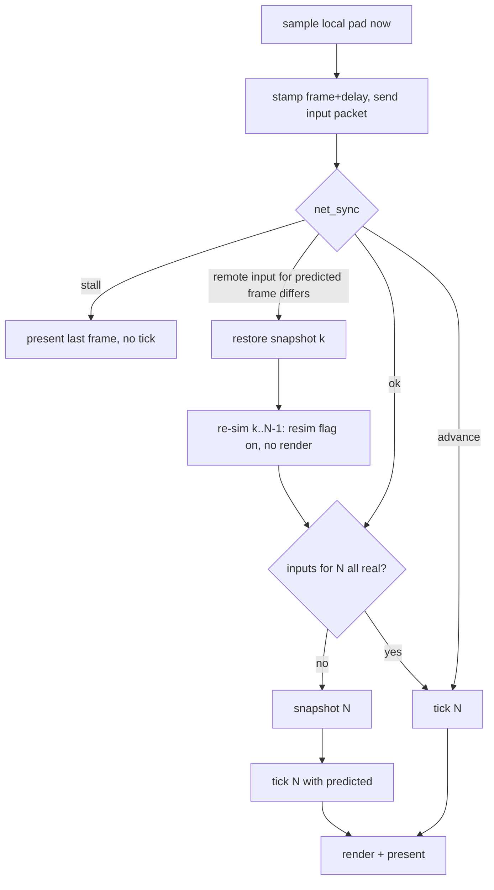

# Netcode plan: rollback, serverless matchmaking, ranked, LAN

Expands ROADMAP.md Phase 4. Everything below is grounded in the current tree
(`file:line`) or a cited external source. Model: Slippi's rollback and set
flow, re-implemented natively; matchmaking and ranked replace Slippi's central
server with the BitTorrent Mainline DHT and signed, on-device rating records.

## 1. Decisions

| Topic | Decision | Why |
|---|---|---|
| Rollback | Slippi numbers: input delay default 2 (user 0–4), rollback window 7, prediction = repeat last input, snapshot only on predicted frames | Proven on this exact game; native snapshot is cheaper than Dolphin's so delay can go lower |
| Snapshot | Whole-region `memcpy` of game statics + live OSAlloc heaps, audio heap excluded | Same shape as `SlippiSavestate.cpp`; ~2.2 MB statics (measured) + heaps; optimise only if measured > 2 ms |
| Transport | Raw UDP, Slippi packet layout, inputs resent every frame until acked, ~150-line stop-and-wait for lobby messages | No transport lib exists today (`CMakeLists.txt:32-55`); ENet only if the reliable channel turns out to be more than that |
| Matchmaking | Mainline DHT (jech/dht, MIT, ~3.1k lines C) — `announce_peer(implied_port=1)` + `get_peers` on time-bucketed topic infohashes; BEP 42 `ip` field for external endpoint; simultaneous UDP open from the same socket | Serverless; the DHT *is* the rendezvous and reports the NAT mapping, so no STUN in v1 |
| NAT failure | Re-queue for another opponent (Slippi behaviour) | No relay = no infrastructure. libjuice (MPL-2.0) only if measured failure rate justifies it |
| Modes | Ranked, Unranked, Direct (connect code), LAN (mDNS) — all one engine, LAN just runs delay 0 | One code path |
| Identity | ed25519 keypair per install (Monocypher, BSD-2/CC0); code = `NAME#XXXX` (XXXX = base32 of pubkey hash) | No accounts; code stable, name free |
| Rating | Weng-Lin / OpenSkill 1v1 update computed identically on both peers from a doubly-signed match record; published as BEP 44 mutable item; hash-chained history | Same family Slippi appears to use; deterministic pure function; verifiable, honestly not cheat-proof |
| Menu | New `SEL_VS_ONLINE` in the VS Mode submenu → `GM_ONLINE` mode with a lobby scene, then vanilla CSS/SSS/VS/Results driven by synced inputs | Native look; reuses `gm_Mode_Vs_States` shape |
| Double Dash decomp | Nothing reusable as code: `NetGameMgr.cpp`/`LANEntry.cpp`/SDK IP stack are empty NonMatching stubs; only `NetGateApp.cpp` and `LANSelectMode.cpp` match. Borrow the UX: counter screen, host-owns-rules, sleep/awake barriers, halt-together | See §8 |

## 2. What the tree gives us today (hook points)

| Concept | Where | Notes |
|---|---|---|
| Frame loop | `gm_801A4D34` `src/melee/gm/gmscene.c:281-395` | Runs one sim tick per queued pad sample (`:312-374`), renders once (`:379-388`). Already "N ticks, one present" |
| Sim tick body | `gmscene.c:312-374` | `lb_800198E0`→`HSD_PadRenewMasterStatus`, `lb_80019900`, `gm_EvaluateAllControllerInputs`, `on_frame`, `lbAudioAx_80027DF8`, `HSD_GObj_RunProcs` |
| Local pad sample | `HSD_PadRenewRawStatus` `src/sysdolphin/baselib/controller.c:55-65` (`PADRead(now)`) | Fired by 1/60 s OSAlarm `fn_800195FC` `src/melee/lb/lb_0195.c:52`, delivered on the game thread from `pc_frame_boundary` `src/pc/vi.c:161` |
| Input injection | `HSD_PadRenewMasterStatus` `controller.c:351` reads `p->queue[p->qread]` | Replace the 4×`PADStatus` (16 B each on PC, `extern/aurora/include/dolphin/pad.h:112-126`) here. Every gameplay and menu consumer derives from `HSD_PadMasterStatus` (`fighter.c:1834-1890`, `gm_1A36.c:113-117`, `mncharsel.c:2414-2419`). Keyboard/touch already merge into port 0 via `PADSetVirtualStatus` (`src/pc/keyboard.c:150`) |
| Present / pacing / events | `pc_frame_boundary` `src/pc/vi.c:37-173` via `VIWaitForRetrace` `vi.c:176` | 60 Hz pacing at `vi.c:130-150` is where time-sync nudging goes |
| Frame counter | `gm_80479D58.unk_0` `gmscene.c:359` (static) | Expose as the rollback frame index |
| Sound start choke point | `AXDriver_8038CFF4` `src/sysdolphin/baselib/axdriver.c:597`, sole caller `fn_80023750` `src/melee/lb/lbaudio_ax.c:229-246` | Sim thread only links an `HSD_SM` record; voices are acquired on the SDL audio thread (`synth.c:1215`). Return −1 while re-simulating |
| Music start | `lbAudioAx_80023F28` `lbaudio_ax.c:444` | Gate during re-sim |
| Rumble | `HSD_PadRumbleInterpret` `controller.c:64` | Gate during re-sim |
| RNG | single LCG `seed` `src/sysdolphin/baselib/random.c:3-16`, seeded from `OSGetTick` `src/melee/gm/gmmain.c:169` (`MELEE_SEED` override) | Exchange at connect |
| Match settings | `StartMeleeData` (`StartMeleeRules` 0x60 B + `PlayerInitData[6]`) `src/melee/mn/types.h:259`, in `VsModeData.start` | `onEnterDebugVs` `src/melee/gm/gmvsmode.c:161` is the template for "start GS_VS from a filled struct" |
| Mode/scene tables | `modes[]` `src/melee/gm/gmscdata.c:388`, `scenes[]` `:65`, `gm_Mode_Vs_States` `gmvsmode.c:28-129` | Add `GM_ONLINE` + `GS_ONLINE_LOBBY` |
| VS submenu | `mn_803EB6B0[MENU_KIND_VS]` `src/melee/mn/mnmain.c:378`, think `mn_8022D594` `:2473-2553`, `SEL_VS_NAME` last `src/melee/mn/forward.h:166` | Add `SEL_VS_ONLINE = 5`, `selection_count` 5→6, fix the wrap at `mnmain.c:2541-2552` |
| Menu labels | matanim texture frame `start_frame + selection*2` `mnmain.c:943,1481` (MnMaAll); free text via `HSD_SisLib_803A70A0` (`mncharsel.c:475`) | v1 labels as SIS text, textures later |
| Memory | MEM1 = one 96 MB mmap (`extern/aurora/lib/dolphin/os/OSMemory.cpp:226-290`); no `malloc` in game code; allocator statics outside MEM1 listed in §4 | Game statics: `libmelee_game.a` = 354 KB `.data` + 1.80 MB `.bss` (`size -t`) |
| Threads touching game memory | SDL audio (`src/pc/audio.c:559-575`, every 5 ms), DVD worker + ARQ (`dvd.cpp:560-611`, `AR.cpp:134-149`), FIFO draw-done cb | All bracket with `OSDisableInterrupts` = recursive mutex `src/pc/os.c:33-40` |
| Settings | `launcher.cfg` under `SDL_GetPrefPath` (`src/pc/main.c:328`), `Preferences` `src/pc/launcher_data.hpp:17-40`, `extern "C" pc_is_*` accessors (`launcher.cpp:1595`) | Pattern for `net_delay`, `display_name`, identity path |
| Networking | libcurl (Linux, optional) / WinHTTP for the updater only (`src/pc/updater.cpp:409-611`); nothing on Android/iOS | All net code is new |

## 3. Architecture

```
src/pc/net/            PC layer (C, platform compiler)
  net_udp.c            one non-blocking UDP socket, DSCP EF, WSAStartup
  net_proto.c          packet encode/decode, ack, reliable stop-and-wait
  net_sync.c           input queues, prediction, time-sync, stall/advance
  net_snapshot.c       region table, capture/restore ring (8 slots)
  net_dht.c            jech/dht + BEP 42 ip + BEP 44 put/get, bootstrap cache
  net_match.c          queues (ranked/unranked/direct), handshake, rules exchange
  net_lan.c            mDNS announce/browse (mjansson/mdns), lobby peer list
  net_rank.c           identity, Weng-Lin update, signed records, publish/verify
src/melee/gm/gmonlinemode.c   GM_ONLINE state machine (lobby → CSS → SSS → VS → Results)
src/melee/mn/mnonline.c       submenu (Ranked / Unranked / Direct / LAN / Profile), lobby panel, HUD text
src/sysdolphin/baselib/controller.c   input injection (one `if (pc_net_active())` in HSD_PadRenewMasterStatus)
src/melee/gm/gmscene.c                tick body factored into gm_RunSimTick(); online loop calls pc_net_* around it
```

Per-frame flow in online play (replaces `gmscene.c:312-374` when `pc_net_active()`):



Rules: the game thread owns everything; net I/O is polled from the loop (no
net thread). Snapshot/restore happens under `OSDisableInterrupts` so the audio
callback cannot interleave.

## 4. Rollback engine

**Inputs.** Wire unit = 8 B per port per frame (Slippi's `SlippiPad.h`:
buttons u16, 4 stick s8, 2 trigger u8); expanded to the 16 B PC `PADStatus`
at injection with `err = 0` for both peer ports and `PAD_ERR_NO_CONTROLLER`
for ports 3–4. Local port = P1 for the host (lower pubkey), P2 for the guest.
Stick at-rest clamp ±2 before sending (Slippi `TriggerSendInput.asm:100-125`)
so idle noise does not cause rollbacks.

**Snapshot regions** (capture/restore, in this order):
1. `libmelee_game.a` `.data/.bss` bracketed by linker symbols from a GNU ld
   `INSERT AFTER .data` script (`*libmelee_game.a:(.data .data.* .bss .bss.* COMMON)`).
   No section grouping exists today (`CMakeLists.txt:156`, no `-fdata-sections`).
2. Live spans of every OSAlloc heap except the audio heap
   `HSD_Synth_804D6018` (`src/sysdolphin/baselib/initialize.c:171-186`):
   main heap (recreated per scene, `initialize.c:203-236`), lbHeap sub-heaps
   (`src/melee/lb/lbheap.c:22-25`). Span = heap start .. highest allocated
   cell end, from the same walk `MELEE_HEAP_CHECK` uses (`OSAlloc.cpp:65-84`).
3. Allocator/engine statics outside MEM1: `ArenaLow/High` (`OSArena.cpp:10-11`),
   `sHeapArray/sNumHeaps/__OSCurrHeap` (`OSAlloc.cpp:434-449`), `obj_heap`,
   `alloc_datas` (`objalloc.c:13-19`), `current_heap` (`initialize.c:180-183`),
   `seed`/`HSD_RandSeedPtr` (`random.c:3-4`), `lbHeap_80431FA0`, pad
   queue indices, `HSD_PadMaster/Copy/GameStatus`, `controller_map`.
4. Preserve-after-restore (netcode's own state, like Slippi's ODB/RXB): the
   net input ring and frame counters live in `src/pc/net`, outside every region.

Excluded: audio heap and all `axdriver/synth/lbaudio_ax` statics (audio thread
owns them; restoring tears linked lists and double-frees voices —
`synth.c:490,749,1038`), XFB + GX FIFO, ARAM (read-only after load), texture
cache (ids only; a stale `GXTexObj` just re-hashes and re-uploads,
`texture.cpp:47-127`).

`ponytail:` full memcpy per snapshot; expected 10–25 MB, 1–3 ms. Add dirty-page
tracking only if the resim budget (7 restores + 7 ticks < 8 ms) is missed.

**Side effects during re-sim** (`pc_net_resim` flag): `AXDriver_8038CFF4`
returns −1; `lbAudioAx_80023F28` no-op; `HSD_PadRumbleInterpret` skipped;
render block `gmscene.c:379-388` not executed. v2: Slippi's per-frame SFX log
(16 sounds × 7 frames): dedupe on re-sim, key-off sounds the corrected
timeline never played (`LoopEngineForRollback.asm:70-118`). Sound→sim
feedback exists in exactly two places and is cosmetic: `Ground_801C54DC`
`src/melee/gr/ground.c:3120` (Corneria radio chatter, `grcorneria.c:2621`)
and the tournament screen; leave as known divergence.

**Time sync** (copy Slippi `SlippiNetplay.cpp:1660-1725`, `EXI_DeviceSlippi.cpp:1478-1641`):
offset sample per received packet = `sendTime − myLastSendTime + 16683·(myFrame − theirFrame)`,
30-sample ring, trimmed mean (drop top/bottom third). Every 30 frames: ahead
> 10 ms → stall ≤ 5 frames; behind > 26.7 ms → advance (2 ticks in one
present) ≤ 3 frames, 1 per 5 frames. Continuous nudging: ±0.5–1 % on the
`SDL_DelayPrecise` target in `vi.c:130-150` instead of emu speed. Hard stall
when remote lags > 7 frames; disconnect after 7 s stalled.

**Desync detection.** Each input packet carries `(checksumFrame, checksum)`
of the newest finalised frame: checksum over `*HSD_RandSeedPtr`, each
fighter's position/facing/percent/stocks/action state. Mismatch → HUD
warning + log; ranked → abort set with "desync" (Slippi's synced-state restart is v2).

## 5. Determinism prerequisites (M0)

Findings from the flag/libm audit (all four AArch64 targets plus MinGW and Linux):
1. Game code already has `-fno-strict-aliasing -fwrapv -ffp-contract=off` (`CMakeLists.txt:76-77`), but `aurora_mtx`/`aurora_gx` and `src/pc/*.c` do not → AArch64 emits `fmadd` in `PSVECNormalize` (`extern/aurora/lib/dolphin/mtx/vec.c:41`), `PSMTXMultVec`, `C_MTXRotRad`, used by collision (`mplib.c:1183,4919`). Fix: `-ffp-contract=off` on `aurora_mtx`, `aurora_gx`, `aurora_gd`, and the `melee` target.
2. `sinf/cosf/tanf/atanf` resolve to platform libm (glibc / mingw-w64 CRT / bionic / iOS) — used by `fighter.c:2217`, `ftcoll.c:910,2856`, `camera.c`, `ground.c:2882`, `mtx.c:334-379` — and `lbtrigf.c:147` only compiles the decomp's `atanf` under `__MWERKS__`. Fix: vendor one implementation (musl's `sinf/cosf/tanf/atanf`, MIT) into `src/pc/libm/`, `#define sinf pc_sinf` in `src/pc/compat.h` plus `-fno-builtin-sinf …`. `sqrtf/sqrt/fabsf/fmodf` are correctly rounded — leave.
3. Unify `-O2` (Linux is RelWithDebInfo, Windows/Android Release `-O3`: `tools/package_windows.sh:56`, `tools/build_android.sh:39`); keep `MELEE_ENABLE_LTO=OFF`; add `-ftrivial-auto-var-init=zero` to `melee_game`.
4. RNG: force an agreed seed at connect (`gmmain.c:169-174` already honours `MELEE_SEED`); `_HSD_RandForgetMemory` resets per scene (`random.c:23-28`) — must be in the snapshot.
5. Disc I/O: a file-cache hit completes the load synchronously, a miss takes N frames (`src/melee/lb/lbfile.c:145-150`); callbacks run on the DVD worker (`dvd.cpp:560-611`). Rule: prewarm every file the match needs (stage, both fighters, items, SFX banks) behind the "ready" barrier, so every in-match load is a 0-frame hit on both peers. Verify with a load-log injection (`MELEE_LOG_DVD`).
6. Alarms are wall-clock (`src/pc/os.c:174-215`); online ticks are driven by the loop, not the pad alarm.
7. Match-start state that must be identical on both peers (`gm_80167BC8` `src/melee/gm/gm_1601.c:3595-3727`): memcard `GameRules`/`GamePrefs`, handicap, unlock bitmasks (`gm_1601.c:2384`), random-stage switches, frozen-stadium (`grpstadium.c:2057-2067`), Sheik/Zelda A-hold at load (`gmvs.c:1597`). Host ships the 0x60-byte `StartMeleeRules` + `PlayerInitData[4]` + stage + seed + toggles; guest overwrites its copy; unlock-all forced on in online modes.

**Harness (must exist before M1):** `MELEE_NET_RECORD=file` records seed + per-frame 4×PADStatus + per-frame checksum; `MELEE_NET_REPLAY=file` replays and diffs. Validate by injecting a one-ULP change into `pc_sinf` and confirming the diff appears; then run one recording on x86-64 Linux, Windows (Proton and native), and Android; all must match.

## 6. Transport and protocol

UDP only, one socket shared by DHT, game and lobby traffic (keeps the NAT
mapping warm; the DHT's own traffic is ~1 packet/min). Linux `SO_PRIORITY 7` +
`IP_TOS 0xb8`, Windows qWAVE DSCP 46 (Slippi `SlippiNetplay.cpp:953-1004`).

| Message | Layout | Channel |
|---|---|---|
| `INPUT` | `u8 type, s32 frame, u8 player, s32 ckFrame, u32 ck, N × 8 B pads (newest first)` — N = all inputs newer than the last ack, cap 128 | unreliable, sent every tick and again 8 ms later (`ponytail:` double-send halves loss cost for 7 KB/s; drop if measured useless) |
| `ACK` | `u8 type, s32 frame, u8 player` | unreliable; ping = RTT of ack |
| `HELLO/HELLO_ACK` | version, pubkey, signature over (nonce, peer pubkey), mode, ruleset hash, rating head | reliable |
| `RULES` | `StartMeleeRules` + `PlayerInitData[4]` + stage + seed + toggles | reliable |
| `READY` | per-peer prewarm complete | reliable (barrier) |
| `SET_STEP` | Slippi `COMPLETE_STEP`: char/color/stage picks between games | reliable |
| `RESULT` | signed match record (see §9) | reliable |
| `CHAT` | quick-chat id (16 D-pad combos, Slippi ids) | reliable |
| `BYE` | reason | reliable, 3 sends |

Reliable = seq + ack + 250 ms retransmit, one in flight; that is all the
lobby needs. Connect timeout 8 s; keep-alive 1 s; peer gone after 10 s silent.

## 7. Serverless matchmaking (DHT), NAT, connect codes

**DHT.** jech/dht (`dht_init` takes our fd, `dht_periodic` returns the next
sleep; Windows since 0.15; maintained 2026). Patches (~220 lines): parse the
top-level `ip` field (BEP 42) from responses, vote across ≥3 responses →
our external `ip:port`; add BEP 44 `put`/`get` for rating records. SHA-1 =
Steve Reid public-domain `sha1.c`. Bootstrap: shipped seed list + nodes
persisted at shutdown (`dht_get_nodes`) + the public routers
(`router.bittorrent.com`, `dht.transmissionbt.com`, `router.utorrent.com`) as
last resort. Search only after `good ≥ 4 && good+doubtful ≥ 30`.

**Topics.** `infohash = SHA1(topic)`:
- Unranked queue: `meleepc/v1/unranked/<unix_minute>`; announce under the current minute, query current and previous.
- Ranked queue: `meleepc/v1/ranked/<band>/<unix_minute>`, band = `floor(display_rating / 150)`; widen to ±1 band after 30 s, ±2 after 90 s.
- Direct: `meleepc/v1/direct/<CODE>`; both players type the other's code (or one hosts, the other joins — same topic either way).
- Rating records: BEP 44 mutable item keyed by the player's ed25519 pubkey (§9).

**Rendezvous = the DHT itself.** `announce_peer` with `implied_port=1`
stores the announcing socket's *observed* `ip:port`; `get_peers` returns it.
Both sides therefore learn each other's NAT mapping without any server, then
send `HELLO` simultaneously from the same socket for 8 s (Slippi's
simultaneous-connect, `SlippiMatchmaking.cpp:320-338`). Same external IP →
also try the LAN address carried in `HELLO` (`ipAddressLan` trick). Works on
endpoint-independent NATs (~82 %, Ford et al. 2005); symmetric NAT →
"Couldn't connect, searching again" and re-queue, exactly like Slippi.
`ponytail:` no STUN, no ICE, no relay in v1; add libjuice only if telemetry
(local log, opt-in) shows the failure rate matters.

**Pairing.** Candidates from `get_peers` are contacted in RTT order; a
`HELLO` carries `(mode, version, ruleset hash, rating band)`. The lower pubkey
proposes a match id; first mutual `HELLO_ACK` wins; both stop announcing.
Stale announces are harmless because the topic rolls over every minute.

**Connect code.** `NAME#XXXX`: `NAME` = 1–8 chars chosen by the player (name
entry keyboard, `mnName_8023AC40`), `XXXX` = base32 of the first 20 bits of
`SHA1(pubkey)`. Direct topics hash the full string; the lobby shows the
pubkey fingerprint so a collision is visible. Full-width `#` (0x8194) for
in-game text as Slippi does.

## 8. LAN

Discovery: mDNS/DNS-SD `_meleepc._udp.local` via mjansson/mdns (public
domain, header-only), separate socket on 5353. UI is the Double Dash pattern
(`NetGateApp.cpp` state machine; Nintendo LAN guide): pick **LAN** → "N
players found — press Start" counter screen; first Start elects the host; host
gets the rules panel, others see "Waiting for host"; `READY` barrier around
loads (MKDD `sleep()/awake()`); any error halts everyone to one message
screen (MKDD `LA_*` labels), never a half-dead lobby. Direct IP entry via the
name-entry keyboard as fallback. Same rollback engine with delay 0 (auto).
Platform notes: Windows fires the firewall prompt on first inbound bind
(installer adds a rule); Android needs `WifiManager.MulticastLock` via JNI
while the LAN menu is open.

## 9. Ranked and on-device rating

**Identity.** `identity.key` (ed25519 seed) beside `launcher.cfg`; Monocypher
`crypto_ed25519_*` + SHA-512. Lost key = new identity; export/import via the
Profile panel.

**Rating.** Weng-Lin (OpenSkill) Bradley-Terry full-pairing, 1v1: μ₀ = 25,
σ₀ = 25/3, β = 25/6, τ = 25/300; ordinal = μ − 3σ; displayed rating =
`1000 + 40·ordinal` (placement badge while `n < 5`, Slippi's threshold). The
update is a pure function — implement once in `net_rank.c` in double with the
same strict FP flags as the game so both peers produce identical bits; tier
names/thresholds are a client-side table (Slippi keeps those client-side too,
`SlippiMatchmaking.cpp:606-704`).

**Ruleset** (Slippi ranked): 4 stock, 8:00, items off, pause off, legal
stages FoD/PS/YS/DL/BF/FD; Bo3 set; game 1 stage random; loser picks with 2
bans; tie → 1-stock 3-min tiebreak. Both peers validate the `RULES` blob and
tear down on violation (client-side enforcement, like `EXI_DeviceSlippi.cpp:2426-2451`).

**Match record** (canonical CBOR-ish fixed layout, ≤ 400 B):
`{v, match_id, key_a, key_b, ruleset_hash, games[≤4]{winner, stocks_a, stocks_b, frames, stage}, mu_a, sig_a, mu_b, sig_b (pre), prev_hash_a, prev_hash_b, ts}`,
signed by both. Each player appends it to a local append-only history, applies
the update, and publishes `{mu, sigma, n, head_hash, name}` as a BEP 44
mutable item (`seq` = n, `salt` = "meleepc-rank-v1", re-announce hourly).

**Verification** when two ranked players meet: `HELLO` carries the claimed
head; each side does a BEP 44 `get` of the other's item, checks the signature
and that the claimed `(mu, sigma, n, head_hash)` matches. Mismatch → play
unranked or refuse. Loss suppression is detectable, not preventable: the
winner also publishes the double-signed record as an immutable BEP 44 item
keyed by its hash and keeps it; a client that holds a signed record a peer's
chain omits refuses to ranked-match that peer. Sybil/collusion are free.
State this in the UI ("community rating, unverified"). Anything stronger
needs a third party — out of scope by design.

## 10. Native menu integration

1. **VS Mode submenu**: `SEL_VS_ONLINE = 5` (`mn/forward.h:161-167`),
   `mn_803EB6B0[MENU_KIND_VS].selection_count = 6` (`mnmain.c:378`), case in
   `mn_8022D594` next to `SEL_VS_TOURNAMENT` (`mnmain.c:2493-2498`) setting
   `pending_mode = GM_ONLINE`; wrap-around at `mnmain.c:2541-2552` uses the
   new last item; add an `AnimLoopSettings` row (`mn_803EB48C`, `:309`) and a
   description (`mn_803EB678`, `:353`, or literal via `HSD_SisLib_803A70A0`).
   Label: matanim frame 50 in `MnMaAll` is unused but blank → v1 draws
   "ONLINE" with SIS text at the slot position; v2 patches the texture into the
   texture-replacement pack path we already ship.
2. **Online submenu**: new `MENU_KIND_ONLINE` row (rows 7–10 are free,
   `mnmain.c:1022-1024`): Ranked / Unranked / Direct / LAN / Profile.
3. **`GM_ONLINE`** in `GameModeKind` (`gm/forward.h:19-66`), `modes[]` row,
   `gm_Mode_Online_States[] = { LOBBY, CSS, SSS, VS, SUDDEN_DEATH, RESULTS }`
   copying `gm_Mode_Vs_States` (`gmvsmode.c:28-129`). Lobby = `GS_ONLINE_LOBBY`
   scene reusing the Names panel assets (`mnname.c:1611-1749`,
   `MenMainConNmTp`) for status text: searching → found `NAME#XXXX (1234)` →
   connecting → ping/delay → loading. Quick chat via D-pad in lobby and CSS.
4. **CSS/SSS under sync**: both ports `err = 0`; the remote cursor is driven by
   the remote's synced `PADStatus` — no lock-in protocol needed because
   `mncharsel.c:2414-2419` reads only `HSD_PadCopyStatus[port]`. Menus run
   lockstep at delay = RTT frames (snapshots off); the rollback path is armed
   at `GS_VS` enter. Ranked skips SSS (stage from set flow); Direct/Unranked
   use the vanilla SSS. Random character/stage use `HSD_Randi` and therefore
   the shared seed.
5. **In-game HUD**: opponent name, delay and ping via `HSD_Text` on the HUD
   canvas (Slippi `InitInGame.asm:163-237` places names the same way); an
   optional rollback-frames counter behind `MELEE_NET_DEBUG`.
6. **Results**: vanilla `GS_RESULTS` (both ports present); ranked shows the
   rating delta on the lobby return.
7. **Settings**: `net_delay` (auto/0–4), `display_name`, `net_port` (0 = random
   41000–50999) in `Preferences` + `launcher.cfg` + `pc_get_net_*` accessors;
   F1 overlay page mirrors them. Memory-card writes stay enabled (VS records) —
   they run at results, outside the synced region.

## 11. Ultra-low-latency plan

Ordered by expected gain per line of code:
1. **Rollback at low delay.** Native tick + restore is cheap, so ship
   delay auto = `clamp(round(RTT/2 / 16.7) − 2, 0, 4)` with 7-frame rollback
   absorbing the rest; Slippi defaults to 2 because Dolphin savestates cost more.
2. **Late local poll.** Sample the pad at tick start (`gm_RunSimTick`) instead
   of consuming the alarm-phase sample — up to one frame of phase latency
   removed; with the Phase 2 1000 Hz adapter thread the sample is ≤ 1 ms old.
3. **Just-in-time tick.** Measure tick+render time (`HSD_PerfSetCPUTime`,
   `gmscene.c:366`) and delay tick start until `next_vblank − (tick+render) − 1 ms`
   in `pc_frame_boundary` when vsync is on; with `MELEE_VSYNC=0` (Mailbox,
   `main.c:336`) already near-minimal. Dolphin cannot do this.
4. **Send early, send twice.** Local input goes out the moment it is sampled
   (before the tick) and again mid-frame; the delay ring means the remote gets
   it `delay` frames before it needs it.
5. **QoS marking** (§6) and no jitter buffer (the 7-frame window is the buffer).
6. **Pacing nudge instead of stalls** where possible (§4 time sync), so the
   local frame cadence stays smooth.
7. **XFB path**: `HSD_VICopyXFBAsync` waits for a free XFB (`video.c:188-201`);
   check whether that adds a frame of queueing versus presenting directly —
   measure with `MELEE_NET_DEBUG` timestamps before touching it.
8. Frame interpolation (Phase 3) is presentation only and must not move the sim.

## 12. Milestones and acceptance

| M | Deliverable | Acceptance (all runnable, no project-wide suites) |
|---|---|---|
| M0 Determinism | §5 items 1–4, record/replay harness | Same recording replays bit-identical on Linux x86-64, Windows (native), Android; injected 1-ULP libm change is caught |
| M1 Local rollback | `gm_RunSimTick`, snapshot ring, resim flag, SFX/music/rumble gates, frame index | "Sync test" mode (`MELEE_NET_SYNCTEST=k`): every frame restore k frames back and re-sim with identical inputs; per-frame checksum equals the straight run for a 5-minute 4-player CPU match; resim cost logged (< 8 ms for 7 frames) |
| M2 Two-player direct | UDP transport, input sync, time sync, desync checksum, `GM_ONLINE` lobby via `MELEE_NET_CONNECT=ip:port` | Two processes on one machine finish a full set (lobby→CSS→SSS→VS→results→CSS) with `tc netem delay 60ms loss 2%` and zero desyncs; HUD shows ping/delay |
| M3 LAN | mDNS lobby, counter screen, host-owns-rules, barriers, halt-together | Two machines on Wi-Fi find each other without typing anything; unplugging one shows the halt screen on the other within 10 s |
| M4 Internet | DHT (jech/dht + BEP 42/44), topics, simultaneous open, Direct + Unranked queues, connect codes | Two home NATs (different ISPs) connect via Direct code with no port forwarding; unranked queue pairs two clients within 60 s; symmetric-NAT failure re-queues with a message |
| M5 Ranked | identity, Weng-Lin, signed records, BEP 44 publish/verify, ranked set flow, tiers UI | After a Bo3 both clients hold identical rating bits; opponent's published item verifies; a tampered local history is rejected by the peer |
| M6 Latency polish | §11 items 2–4, 7; SFX log dedupe; quick chat; label textures | Measured button→photon latency (LED + high-speed camera or photodiode) at delay 1 ≤ Slippi at delay 2 on the same hardware |

**Prototype (branch `netcode-prototype`)**: `src/pc/net.c` — delay-based
lockstep over raw UDP, hooked at `gmscene.c` before `lb_800198E0`. Env:
`MELEE_NET=host:port`, `MELEE_NET_PORT`, `MELEE_NET_PLAYER=0|1`,
`MELEE_NET_DELAY` (default 2); run both peers with the same `MELEE_SEED` and
`--no-card`. Verified on localhost: 2400 lockstep frames at 60 fps, inputs
cross both ways, mismatched seeds are flagged as `DESYNC` at frame 0. This is
M2's transport + input sync; M0 and M1 build on it.

New third-party code, all vendored as source, all static: jech/dht (MIT),
mjansson/mdns (PD), Monocypher (BSD-2/CC0), sha1.c (PD), musl trig (MIT).
No MSVC-only artefacts; Windows needs `ws2_32` + `iphlpapi` (add `iphlpapi.dll`
to the objdump gate allowlist in `tools/package_windows.sh:184`).

## 13. Risks and open questions

- **GX FIFO during sim**: `GXGeometry.cpp:228-232` suggests commands can land in the MEM1 FIFO from sim code [INFERENCE]. M1 must prove a resim tick emits nothing (FIFO write-watch); otherwise gate `GX*` in resim.
- **Android**: PC layer is clang, game code is GCC; the audio/mtx FP fixes in §5 cover it, but M0's cross-platform replay is the gate before promising Android↔desktop play.
- **DHT dependence on public bootstrap routers** — mitigated by persisted nodes + shipped seed list; LAN peers also seed.
- **Rating honesty** — §9 is explicit: verifiable, not cheat-proof. Don't market it as anti-cheat.
- **Snapshot size** unknown until measured; the heap-span walk decides whether dirty tracking is needed.
- **Menu lockstep feel** at high RTT (CSS at ~6 frames delay). Slippi's lock-in UI is the fallback if it feels bad.
- **Memory-card/unlock state** must not diverge mid-match; only results-time writes are allowed while synced.

## 14. Sources

- Slippi: `project-slippi/Ishiiruka` `Source/Core/Core/Slippi/{SlippiNetplay,SlippiMatchmaking,SlippiSavestate}.cpp`, `Source/Core/Core/HW/EXI_DeviceSlippi.cpp`; `project-slippi/slippi-ssbm-asm` `Online/Online.s`, `Online/Core/{TriggerSendInput,StartEngineLoop,LoopEngineForRollback}.asm`, `Online/Core/Sound/PreventDuplicateSounds.asm`, `Online/Menus/TitleMenu/OnMenuPrep.asm`, `Online/Slippi Online Scene/main.asm`; `project-slippi/slippi-rust-extensions` `game-reporter/src/queue.rs`, `user/src/lib.rs`.
- BEPs: 5 (DHT), 42 (`ip` field), 44 (mutable items). jech/dht `dht.c`, `CHANGES`.
- NAT: Ford, Srisuresh, Kegel, "Peer-to-Peer Communication Across Network Address Translators", USENIX 2005 (Table 1: 82 % UDP). RFC 8445 §5.1.2.2 candidate preferences.
- Double Dash: `doldecomp/mkdd` `configure.py` L571-574, L620-646, L1245-1269; `src/Osako/NetGateApp.cpp`, `LANSelectMode.cpp`; `include/Osako/NetGameMgr.h`; Nintendo MKDD LAN guide (nintendo.ca PDF).
- Rating: Weng & Lin, "A Bayesian Approximation Method for Online Ranking", JMLR 2011 (OpenSkill). TrueSkill patent US7050868 (expired 2025-01-24).
- Libraries: libjuice README (MPL-2.0, MinGW/Android), ENet `CMakeLists.txt`, Monocypher `LICENCE.md`, mjansson/mdns README, Android `WifiManager.MulticastLock`.
